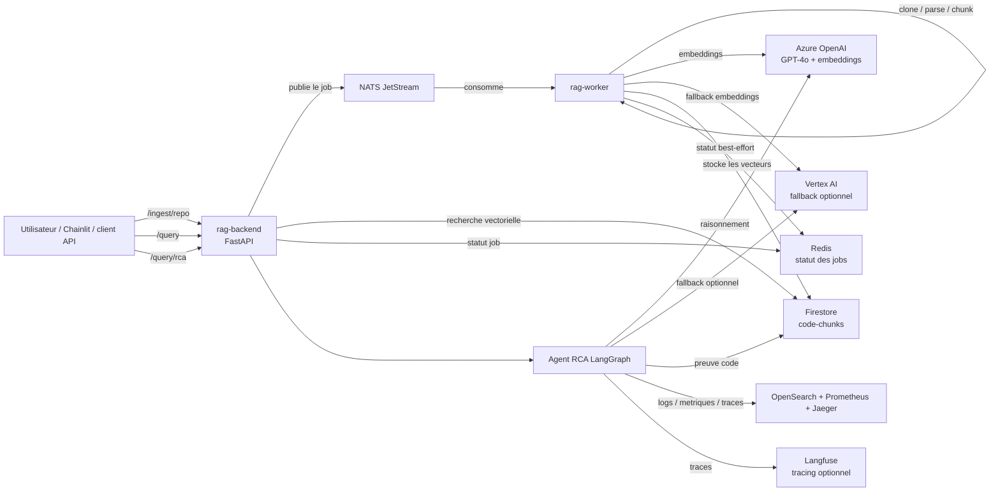

# agentic-rca-platform-app

English version: [README.md](./README.md)

Code applicatif d'une plateforme agentique de Root Cause Analysis.

La plateforme combine un RAG de code, un agent RCA LangGraph et des outils d'observabilite live pour permettre a un SRE ou a un developpeur de poser des questions d'investigation comme :

> "Pourquoi le checkout echoue sur la derniere heure ?"

L'agent recupere le code pertinent depuis un index vectoriel, interroge les logs, metriques et traces via les API d'observabilite, correle les preuves, puis retourne un rapport RCA structure.

## Contenu Du Depot

- `rag-backend` : service FastAPI pour l'ingestion, la recherche vectorielle et les requetes RCA
- `rag-worker` : worker asynchrone NATS JetStream pour l'ingestion de repositories
- `chainlit_ui` : interface conversationnelle pour l'agent RCA
- `backend/agent` : workflow LangGraph RCA et outils associes
- `docs` : documentation technique detaillee
- `scripts` : smoke tests, helpers de requete/RCA et validations live

L'infrastructure et les manifests Kubernetes vivent dans des depots separes :

- `rag-platform-infra` : Terraform pour AKS, Azure OpenAI, Firestore, le reseau et l'identite cloud
- `rag-platform-gitops` : manifests ArgoCD/Kubernetes pour NATS, KEDA, observabilite, deployments applicatifs, Chainlit et Langfuse

## Capacites Principales

- Workflow RCA agentique avec LangGraph
- Recherche de code indexe via Firestore vector search
- Preuves d'observabilite live via les API OpenSearch, Prometheus et Jaeger
- Ingestion event-driven avec NATS JetStream
- Pipeline asynchrone clone, parse, chunk, embed et store
- Azure OpenAI pour le chat et les embeddings
- Chemin Vertex AI derriere des controles explicites `switch` / `fallback`
- UI Chainlit pour le RCA conversationnel
- Tracing Langfuse optionnel pour l'observabilite LLM et agent
- CI/CD avec lint, builds Docker, Trivy, CodeQL, semantic-release, SBOM et signature d'images

## Architecture D'execution

Le backend accepte les requetes d'ingestion, de recherche et de RCA. Les jobs d'ingestion sont publies dans NATS et traites de facon asynchrone par le worker. Les requetes `/query` interrogent Firestore. Les requetes `/query/rca` lancent l'agent LangGraph, qui combine recherche de code, logs, metriques et traces.



Pour plus de detail, voir [docs/ARCHITECTURE.fr.md](docs/ARCHITECTURE.fr.md).

## Agent RCA

`POST /query/rca` execute un graphe RCA en plusieurs etapes :

1. Planifier les outils a appeler.
2. Executer les outils code, logs, metriques et traces.
3. Correler les preuves.
4. Decider si une nouvelle iteration est necessaire.
5. Synthetiser un rapport de cause racine.

Outils actuels :

| Outil | Backend | Role |
|---|---|---|
| `search_code_vectors` | Firestore | Trouver les chunks de code pertinents |
| `query_opensearch_logs` | API HTTP OpenSearch | Recuperer les logs applicatifs |
| `query_prometheus_metrics` | API HTTP Prometheus / PromQL | Recuperer les metriques |
| `query_jaeger_traces` | API HTTP Jaeger | Recuperer les traces distribuees |

L'agent parle aux systemes d'observabilite via leurs API de service. Il ne lit pas directement les logs, metriques ou traces depuis des buckets, PVC ou bases brutes.

## Surface API

| Endpoint | Role |
|---|---|
| `GET /health` | Health check backend |
| `POST /ingest` | Ingestion d'un document simple |
| `POST /ingest/repo` | Mise en file d'une ingestion de repository |
| `GET /ingest/status/{job_id}` | Lecture du statut d'ingestion depuis Redis si disponible |
| `POST /query` | Recherche vectorielle directe sur le code indexe |
| `POST /query/rca` | Execution de l'agent RCA LangGraph, avec streaming SSE optionnel |

Quand le backend tourne :

- `/openapi.json` expose la specification OpenAPI
- `/docs` expose Swagger UI
- `/redoc` expose ReDoc

Reference des endpoints :

- [docs/09-api-reference.en.md](docs/09-api-reference.en.md)
- [docs/09-api-reference.md](docs/09-api-reference.md)

## Developpement Local

Depuis un terminal Windows, les commandes projet sont generalement lancees via WSL.

Demarrer NATS :

```bash
wsl bash -lc "docker run -p 4222:4222 nats:latest -js"
```

Demarrer le backend :

```bash
wsl bash -lc "cd backend && pip install -r requirements.txt && uvicorn main:app --reload"
```

Demarrer le worker :

```bash
wsl bash -lc "cd worker && pip install -r requirements.txt && python main.py"
```

Demarrer Chainlit :

```bash
wsl bash -lc "pip install -r chainlit_ui/requirements.txt && chainlit run chainlit_ui/app.py"
```

## Strategie De Provider

Le runtime supporte deux strategies :

- `fallback` : Azure OpenAI d'abord, Vertex AI seulement en cas d'erreur
- `switch` : forcer explicitement un provider

Variables d'environnement :

```env
LLM_PROVIDER_STRATEGY=fallback|switch
LLM_SWITCH_PROVIDER=azure|vertex
EMBEDDING_PROVIDER_STRATEGY=fallback|switch
EMBEDDING_SWITCH_PROVIDER=azure|vertex
```

La posture stable actuelle de `rag-dev` est Azure-first et forcee avec `switch=azure`. Le chemin Vertex existe pour l'experimentation multi-cloud, mais il est en pause tant que les blockers documentes sur la dimension des embeddings et le modele chat ne sont pas resolus.

## Observabilite

Le tracing Langfuse est optionnel. Si les cles sont absentes, le backend continue sans tracing LLM.

Variables utiles :

```env
LANGFUSE_PUBLIC_KEY=
LANGFUSE_SECRET_KEY=
LANGFUSE_BASE_URL=
```

`LANGFUSE_HOST` reste accepte comme alias legacy de `LANGFUSE_BASE_URL`.

## Documentation

| Sujet | English | Francais |
|---|---|---|
| Architecture | [docs/ARCHITECTURE.md](docs/ARCHITECTURE.md) | [docs/ARCHITECTURE.fr.md](docs/ARCHITECTURE.fr.md) |
| Entree de requete | [docs/01-request-entry.en.md](docs/01-request-entry.en.md) | [docs/01-request-entry.md](docs/01-request-entry.md) |
| Publication NATS | [docs/02-nats-publish.en.md](docs/02-nats-publish.en.md) | [docs/02-nats-publish.md](docs/02-nats-publish.md) |
| Pipeline worker | [docs/03-worker-pipeline.en.md](docs/03-worker-pipeline.en.md) | [docs/03-worker-pipeline.md](docs/03-worker-pipeline.md) |
| Requete vectorielle | [docs/04-query-vector.en.md](docs/04-query-vector.en.md) | [docs/04-query-vector.md](docs/04-query-vector.md) |
| Agent RCA | [docs/05-rca-agent.en.md](docs/05-rca-agent.en.md) | [docs/05-rca-agent.md](docs/05-rca-agent.md) |
| Futur MCP | [docs/06-mcp-future.en.md](docs/06-mcp-future.en.md) | [docs/06-mcp-future.md](docs/06-mcp-future.md) |
| Etat actuel de `otel-demo` | [docs/07-otel-demo-current-state.en.md](docs/07-otel-demo-current-state.en.md) | [docs/07-otel-demo-current-state.md](docs/07-otel-demo-current-state.md) |
| Follow-up metriques | [docs/08-metrics-follow-up.en.md](docs/08-metrics-follow-up.en.md) | [docs/08-metrics-follow-up.md](docs/08-metrics-follow-up.md) |
| Reference API | [docs/09-api-reference.en.md](docs/09-api-reference.en.md) | [docs/09-api-reference.md](docs/09-api-reference.md) |
| ADR - Retrieval RAG production | [docs/10-adr-production-rag-retrieval.md](docs/10-adr-production-rag-retrieval.md) | [docs/10-adr-production-rag-retrieval.md](docs/10-adr-production-rag-retrieval.md) |
| Chainlit + Langfuse | [docs/10-chainlit-langfuse.en.md](docs/10-chainlit-langfuse.en.md) | [docs/10-chainlit-langfuse.md](docs/10-chainlit-langfuse.md) |

## Etat Actuel

- MVP RCA valide avec code, logs et traces
- L'integration des metriques reste un follow-up dedie
- UI Chainlit implementee dans ce depot
- Tracing Langfuse implemente et valide dans `rag-dev`
- `rag-dev` reste actuellement force sur le provider Azure
- Cible Phase 6 : hybride RAG + MCP, avec RAG pour la decouverte semantique et MCP pour la navigation directe dans les fichiers

Les notes de rollout, l'historique live du cluster et les blockers temporaires restent dans [CONTEXT.md](CONTEXT.md), pas dans ce README.

## Structure Du Depot

```text
agentic-rca-platform-app/
|-- backend/
|   |-- agent/
|   |-- llm/
|   `-- routers/
|-- worker/
|   `-- pipeline/
|-- chainlit_ui/
|-- docs/
|-- scripts/
|-- tests/
|-- catalog.yaml
|-- CONTEXT.md
`-- package.json
```

## CI/CD

```text
Pull request -> ci.yml
  -> lint
  -> docker build sans push
  -> Trivy
  -> CodeQL

Push sur main -> release.yml
  -> semantic-release
  -> build et push ghcr.io/kheuchi/rag-backend
  -> build et push ghcr.io/kheuchi/rag-worker
  -> signature des images
  -> generation SBOM
```
