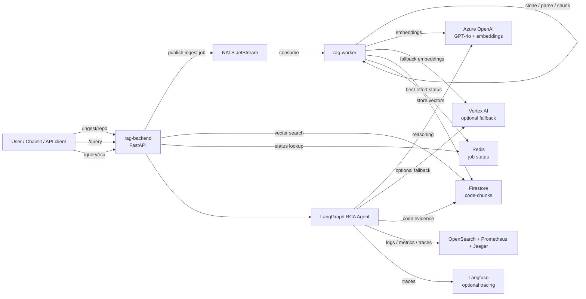

# agentic-rca-platform-app

French version: [README.fr.md](./README.fr.md)

Application code for an agentic Root Cause Analysis platform.

The platform combines code RAG, a LangGraph RCA agent, and live observability tools so an SRE or developer can ask investigation questions such as:

> "Why is checkout failing in the last hour?"

The agent retrieves relevant source code from a vector index, queries logs, metrics, and traces through observability APIs, correlates the evidence, and returns a structured RCA report.

## What This Repository Contains

- `rag-backend`: FastAPI service for ingestion, vector search, and RCA queries
- `rag-worker`: asynchronous NATS JetStream worker for repository ingestion
- `chainlit_ui`: conversational UI for the RCA agent
- `backend/agent`: LangGraph RCA workflow and tools
- `docs`: detailed architecture and phase-by-phase technical notes
- `scripts`: smoke tests, manual query/RCA helpers, and live validation scripts

Infrastructure and Kubernetes manifests live in separate repositories:

- `rag-platform-infra`: Terraform for AKS, Azure OpenAI, Firestore, networking, and cloud identity
- `rag-platform-gitops`: ArgoCD/Kubernetes manifests for NATS, KEDA, observability, app deployments, Chainlit, and Langfuse

## Core Capabilities

- Agentic RCA workflow with LangGraph
- Code search over indexed repositories using Firestore vector search
- Live observability evidence through OpenSearch, Prometheus, and Jaeger APIs
- Event-driven ingestion with NATS JetStream
- Asynchronous clone, parse, chunk, embed, and store pipeline
- Azure OpenAI for chat and embeddings
- Vertex AI provider path behind explicit `switch` / `fallback` controls
- Chainlit UI for conversational RCA
- Optional Langfuse tracing for LLM and agent observability
- CI/CD with linting, Docker builds, Trivy, CodeQL, semantic-release, SBOM, and image signing

## Runtime Architecture

The backend accepts ingestion, search, and RCA requests. Ingestion jobs are published to NATS and processed asynchronously by the worker. Query requests search Firestore directly. RCA requests run the LangGraph agent, which combines code retrieval with live logs, metrics, and traces.



For more detail, see [docs/ARCHITECTURE.md](docs/ARCHITECTURE.md).

## RCA Agent

`POST /query/rca` runs a multi-step RCA graph:

1. Plan which tools to call.
2. Execute code, log, metric, and trace tools.
3. Correlate the evidence.
4. Decide whether another iteration is needed.
5. Synthesize a root cause report.

Current tools:

| Tool | Backend | Purpose |
|---|---|---|
| `search_code_vectors` | Firestore | Find relevant source code chunks |
| `query_opensearch_logs` | OpenSearch HTTP API | Retrieve application logs |
| `query_prometheus_metrics` | Prometheus HTTP API / PromQL | Retrieve metrics |
| `query_jaeger_traces` | Jaeger HTTP API | Retrieve distributed traces |

In this project, those observability backends run in the `otel-demo` namespace — the [OpenTelemetry Demo](https://github.com/open-telemetry/opentelemetry-demo), an open-source project that simulates a small e-commerce application with realistic user traffic, used here as a ready-made source of logs, metrics, and traces.

The agent talks to observability systems through their service APIs. It does not read logs, metrics, or traces directly from buckets, PVCs, or raw databases.

## Design Notes

**Code as RAG corpus.** We chose to ingest source code into the vector index, but the same pipeline handles any structured knowledge — CMDBs, runbooks, API contracts. We could have read code directly through a GitHub or GitLab MCP without any ingestion step; this project demonstrates the full RAG pipeline on a small, self-contained corpus.

**Observability via HTTP APIs.** Querying OpenSearch, Prometheus, and Jaeger directly through their HTTP APIs is a demo choice. In an enterprise setting, the Grafana MCP would be the natural abstraction layer over all observability backends. The current stack is not Grafana-based, which also shaped this approach.

## API Surface

| Endpoint | Purpose |
|---|---|
| `GET /health` | Backend health check |
| `POST /ingest` | Ingest a single document payload |
| `POST /ingest/repo` | Queue repository ingestion |
| `GET /ingest/status/{job_id}` | Read ingestion job status from Redis when available |
| `POST /query` | Run direct vector search against indexed code |
| `POST /query/rca` | Run the LangGraph RCA agent, with optional SSE streaming |

When the backend is running:

- `/openapi.json` exposes the OpenAPI spec
- `/docs` exposes Swagger UI
- `/redoc` exposes ReDoc

Endpoint details:

- [docs/09-api-reference.en.md](docs/09-api-reference.en.md)
- [docs/09-api-reference.md](docs/09-api-reference.md)

## Local Development

The following commands work natively on Linux, macOS, and WSL. On Windows, run them from a WSL terminal.

Start NATS:

```bash
docker run -p 4222:4222 nats:latest -js
```

Start the backend:

```bash
cd backend && pip install -r requirements.txt && uvicorn main:app --reload
```

Start the worker:

```bash
cd worker && pip install -r requirements.txt && python main.py
```

Start Chainlit:

```bash
pip install -r chainlit_ui/requirements.txt && chainlit run chainlit_ui/app.py
```

## Provider Strategy

The runtime supports two provider strategies:

- `fallback`: Azure OpenAI first, Vertex AI only on error
- `switch`: explicitly force one provider

Environment variables:

```env
LLM_PROVIDER_STRATEGY=fallback|switch
LLM_SWITCH_PROVIDER=azure|vertex
EMBEDDING_PROVIDER_STRATEGY=fallback|switch
EMBEDDING_SWITCH_PROVIDER=azure|vertex
```

The current stable `rag-dev` posture is Azure-first and pinned with `switch=azure`. The Vertex path exists for multi-cloud experimentation, but it is paused until the documented embedding-dimension and chat-model blockers are resolved.

## Observability

Langfuse tracing is optional. If the keys are missing, the backend continues without LLM tracing.

Useful environment variables:

```env
LANGFUSE_PUBLIC_KEY=
LANGFUSE_SECRET_KEY=
LANGFUSE_BASE_URL=
```

`LANGFUSE_HOST` is also accepted as a legacy alias for `LANGFUSE_BASE_URL`.

## Documentation

| Topic | English | French |
|---|---|---|
| Architecture | [docs/ARCHITECTURE.md](docs/ARCHITECTURE.md) | [docs/ARCHITECTURE.fr.md](docs/ARCHITECTURE.fr.md) |
| Request entry | [docs/01-request-entry.en.md](docs/01-request-entry.en.md) | [docs/01-request-entry.md](docs/01-request-entry.md) |
| NATS publish | [docs/02-nats-publish.en.md](docs/02-nats-publish.en.md) | [docs/02-nats-publish.md](docs/02-nats-publish.md) |
| Worker pipeline | [docs/03-worker-pipeline.en.md](docs/03-worker-pipeline.en.md) | [docs/03-worker-pipeline.md](docs/03-worker-pipeline.md) |
| Vector query | [docs/04-query-vector.en.md](docs/04-query-vector.en.md) | [docs/04-query-vector.md](docs/04-query-vector.md) |
| RCA agent | [docs/05-rca-agent.en.md](docs/05-rca-agent.en.md) | [docs/05-rca-agent.md](docs/05-rca-agent.md) |
| MCP future | [docs/06-mcp-future.en.md](docs/06-mcp-future.en.md) | [docs/06-mcp-future.md](docs/06-mcp-future.md) |
| Current `otel-demo` state | [docs/07-otel-demo-current-state.en.md](docs/07-otel-demo-current-state.en.md) | [docs/07-otel-demo-current-state.md](docs/07-otel-demo-current-state.md) |
| Metrics follow-up | [docs/08-metrics-follow-up.en.md](docs/08-metrics-follow-up.en.md) | [docs/08-metrics-follow-up.md](docs/08-metrics-follow-up.md) |
| API reference | [docs/09-api-reference.en.md](docs/09-api-reference.en.md) | [docs/09-api-reference.md](docs/09-api-reference.md) |
| ADR - Production RAG retrieval | [docs/10-adr-production-rag-retrieval.md](docs/10-adr-production-rag-retrieval.md) | [docs/10-adr-production-rag-retrieval.md](docs/10-adr-production-rag-retrieval.md) |
| Chainlit + Langfuse | [docs/10-chainlit-langfuse.en.md](docs/10-chainlit-langfuse.en.md) | [docs/10-chainlit-langfuse.md](docs/10-chainlit-langfuse.md) |

## Current Status

- RCA MVP validated with code, logs, and traces
- Metrics integration remains a focused follow-up
- Chainlit UI is implemented in this repository
- Langfuse tracing is implemented and validated in `rag-dev`
- `rag-dev` currently stays pinned to Azure provider selection
- Phase 6 target: hybrid RAG + MCP, where RAG performs semantic discovery and MCP provides direct file navigation

Operational rollout notes, live cluster history, and temporary blockers belong in [CONTEXT.md](CONTEXT.md), not in this README.

## Repository Structure

```text
agentic-rca-platform-app/
|-- backend/
|   |-- agent/
|   |-- llm/
|   `-- routers/
|-- worker/
|   `-- pipeline/
|-- chainlit_ui/
|-- docs/
|-- scripts/
|-- tests/
|-- catalog.yaml
|-- CONTEXT.md
`-- package.json
```

## CI/CD

```text
Pull request -> ci.yml
  -> lint
  -> docker build without push
  -> Trivy
  -> CodeQL

Push to main -> release.yml
  -> semantic-release
  -> build and push ghcr.io/kheuchi/rag-backend
  -> build and push ghcr.io/kheuchi/rag-worker
  -> sign images
  -> generate SBOM
```
