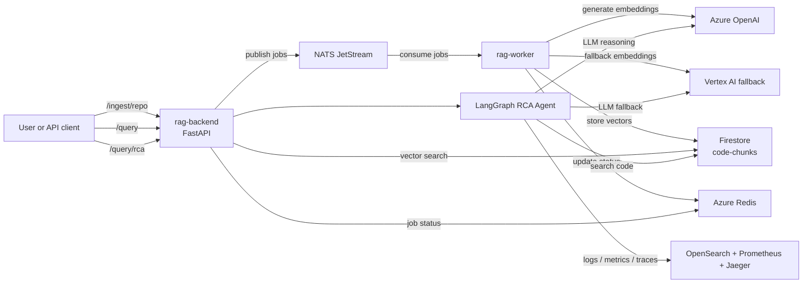

# rag-platform-app

English version. Version francaise: [README.fr.md](./README.fr.md)

Application code for the multi-cloud RAG (Retrieval-Augmented Generation) platform.

This repository contains:
- `rag-backend`: FastAPI API for ingest, query, and RCA
- `rag-worker`: NATS JetStream consumer for asynchronous ingestion

Infrastructure and Kubernetes manifests live in separate repositories:
- `rag-platform-infra`
- `rag-platform-gitops`

## Documentation

The technical documentation is available in both languages.

| Topic | English | Francais |
|---|---|---|
| Architecture | [docs/ARCHITECTURE.md](docs/ARCHITECTURE.md) | [docs/ARCHITECTURE.fr.md](docs/ARCHITECTURE.fr.md) |
| Step 1 - Request entry | [docs/01-request-entry.en.md](docs/01-request-entry.en.md) | [docs/01-request-entry.md](docs/01-request-entry.md) |
| Step 2 - NATS publish | [docs/02-nats-publish.en.md](docs/02-nats-publish.en.md) | [docs/02-nats-publish.md](docs/02-nats-publish.md) |
| Step 3 - Worker pipeline | [docs/03-worker-pipeline.en.md](docs/03-worker-pipeline.en.md) | [docs/03-worker-pipeline.md](docs/03-worker-pipeline.md) |
| Step 4 - Vector query | [docs/04-query-vector.en.md](docs/04-query-vector.en.md) | [docs/04-query-vector.md](docs/04-query-vector.md) |
| Step 5 - RCA agent | [docs/05-rca-agent.en.md](docs/05-rca-agent.en.md) | [docs/05-rca-agent.md](docs/05-rca-agent.md) |
| Phase 6 - MCP future | [docs/06-mcp-future.en.md](docs/06-mcp-future.en.md) | [docs/06-mcp-future.md](docs/06-mcp-future.md) |
| Current `otel-demo` state | [docs/07-otel-demo-current-state.en.md](docs/07-otel-demo-current-state.en.md) | [docs/07-otel-demo-current-state.md](docs/07-otel-demo-current-state.md) |
| Metrics follow-up | [docs/08-metrics-follow-up.en.md](docs/08-metrics-follow-up.en.md) | [docs/08-metrics-follow-up.md](docs/08-metrics-follow-up.md) |
| API reference | [docs/09-api-reference.en.md](docs/09-api-reference.en.md) | [docs/09-api-reference.md](docs/09-api-reference.md) |
| Phase 5 - Chainlit + Langfuse | [docs/10-chainlit-langfuse.en.md](docs/10-chainlit-langfuse.en.md) | [docs/10-chainlit-langfuse.md](docs/10-chainlit-langfuse.md) |

## Runtime architecture

A clearer runtime diagram is available in [docs/ARCHITECTURE.md](docs/ARCHITECTURE.md).



## Where the RCA agent gets logs, metrics, and traces

The RCA agent does not read logs, metrics, or traces from buckets, PVCs, or raw databases directly.

It queries the observability backends through their HTTP APIs:
- logs: OpenSearch HTTP API, via `backend/agent/tools/opensearch.py`
- metrics: Prometheus HTTP API with PromQL, via `backend/agent/tools/prometheus.py`
- traces: Jaeger HTTP API, via `backend/agent/tools/jaeger.py`

In the current AKS deployment, those services run in the `otel-demo` namespace. The agent talks to the observability systems, not to their underlying storage layer.

### Physical storage in the current cluster

What is physically stored where is a separate question from which API the agent calls.

Cluster verification on 2026-04-13 showed:
- Prometheus data is stored in the `otel-demo-prometheus-server` pod under `--storage.tsdb.path=/data`
- that `/data` path is backed by an `EmptyDir` volume, not a PVC
- there are no PVCs or StatefulSets in the `otel-demo` namespace for the currently visible observability workloads

So, in the current environment, Prometheus metrics are physically stored on ephemeral node-backed pod storage and are lost if the pod is recreated.

For OpenSearch and Jaeger:
- the OpenTelemetry demo stack is configured to route logs to OpenSearch and traces to Jaeger
- those backends were misaligned or missing from the live namespace during the 2026-04-14 verification
- the application and GitOps repos are now aligned on `OpenSearch + Prometheus + Jaeger`; deployment sync is still required for the cluster to match that desired state

## Why this design

- Event-driven ingestion: the backend publishes jobs to NATS and returns immediately.
- Decoupled processing: the worker handles clone, parse, chunk, embed, and store asynchronously.
- Multi-cloud setup: Azure OpenAI for LLM and embeddings, Firestore for vector search, Vertex AI as fallback.
- Provider controls: the backend and worker now support `fallback` and explicit `switch` modes for Azure OpenAI vs Vertex AI.
- RCA workflow: the LangGraph agent combines code search with live observability evidence.
- GitOps-friendly deployment: application code stays here, manifests stay in `rag-platform-gitops`.

## Conventional RAG stack — where this project sits

A standard production RAG pipeline covers six layers. This section maps the mainstream choices to the decisions made in this project.

### 1. Ingestion & parsing

Turning PDFs, HTML, Confluence pages, code files into clean text.

- Mainstream: **Unstructured.io**, **LlamaParse**, **Docling** (IBM), **Apache Tika**
- For source code specifically: **tree-sitter** (AST-aware chunking — used by Cursor, Sourcegraph, GitHub Copilot)

### 2. Chunking

Splitting text into overlapping windows of ~200–1000 tokens.

- Mainstream: **LangChain `RecursiveCharacterTextSplitter`**, **LlamaIndex `SemanticSplitter`** (embedding-based topic boundary detection), **Chonkie**
- Enterprise pattern: *parent-child chunking* — index small chunks, return the larger parent to the LLM

### 3. Embeddings

- Mainstream SaaS: **OpenAI `text-embedding-3-small` / `-3-large`**, **Cohere Embed v3**, **Voyage AI**
- Open-source self-hosted: **BGE-M3**, **E5-mistral-7b**, **nomic-embed-text** (served via HuggingFace TGI or Infinity)
- This project: **Azure OpenAI `text-embedding-3-small`** (1536 dims) — same model family as OpenAI, with Azure data residency

### 4. Vector store

Three families in practice:

**Purpose-built vector databases** (most common in greenfield projects)

| DB | Notes |
|---|---|
| Pinecone | SaaS leader, serverless since 2024, expensive at scale |
| Qdrant | Rust, fast, open-source, growing fast |
| Weaviate | Native hybrid search (BM25 + vector) |
| Milvus / Zilliz | Massive scale |
| Chroma | Prototyping only |

**Extensions to existing databases** (preferred when you already have the DB)

| DB | Notes |
|---|---|
| pgvector (PostgreSQL) | Default choice if the team already runs Postgres |
| Elasticsearch / OpenSearch | Strong hybrid BM25 + kNN, widely adopted |
| MongoDB Atlas Vector Search | For MongoDB shops |

**This project: Firestore** — uses the `VECTOR` type + `FIND_NEAREST` operator added in late 2024. Unconventional, but eliminates an extra system to operate, and fits the read-heavy query pattern. Trade-off: no native hybrid BM25 search.

### 5. Retrieval & reranking

- **Hybrid search** (BM25 + vector + RRF fusion) is near-mandatory in production — pure vector search misses exact-match keywords
- **Reranking** after first-pass retrieval: **Cohere Rerank v3** (SaaS), **BGE-reranker** / **Jina Reranker** (open-source), **ColBERT** (late-interaction, high precision)
- **Query transformation**: HyDE, multi-query expansion, query decomposition — LangChain and LlamaIndex both have primitives for these

### 6. Orchestration

- **LangChain** — the historical standard, widely used, criticized for complexity
- **LangGraph** (sub-project of LangChain) — state machine model for agentic RAG and multi-step reasoning; the current reference for complex RAG workflows — this is what the RCA agent uses
- **LlamaIndex** — stronger on indexing and query engines
- **Haystack** (deepset) — common in European enterprise
- **DSPy** (Stanford) — rising adoption, treats prompts as programs to optimize

### Why not Airflow or an advanced ETL tool?

Apache Airflow is a **batch workflow orchestrator** built around DAGs (Directed Acyclic Graphs — a graph with no cycles, so each step runs in a fixed dependency order with no loops). It is designed for scheduled, analytics-oriented pipelines (DataOps, ML training).

RAG ingestion has different requirements:

| Requirement | Airflow | Event-driven pattern |
|---|---|---|
| Ingest a file as soon as it arrives | Poll every N minutes | Immediate (queue/webhook trigger) |
| Granular retry per chunk | Heavy to configure | Native in NATS / Kafka |
| Horizontal worker scaling | Not native | KEDA + Kubernetes |
| Low latency (index in seconds) | High DAG overhead | Native |
| Operational simplicity | Postgres + Redis + webserver + scheduler | Single queue broker |

Airflow does appear in RAG projects at large companies, but for specific use cases: nightly full re-indexing after an embedding model upgrade, upstream data engineering from a data warehouse (Snowflake, BigQuery) before data reaches the RAG layer, or batch sync from Confluence or Jira. In those cases the pattern is typically:

```
Airflow → extract Confluence → clean HTML → drop in S3
                                                  ↓
                         Lambda / worker → embed → vector DB
```

Modern alternatives to Airflow for RAG-adjacent workflows: **Prefect**, **Dagster**, **Temporal** (durable workflows with retry, growing fast in 2025–2026).

This project uses **NATS JetStream + KEDA** instead — the event-driven ingestion pattern matches the workload better than any batch orchestrator.

### Observability & evaluation (often skipped in POCs)

This layer separates a prototype from a production RAG system.

- **Langfuse** — traces, eval, prompt management (open-source) — Phase 5 target in this repo
- **LangSmith** — LangChain's SaaS equivalent
- **Arize Phoenix** — eval + observability, open-source
- **Ragas** — eval framework: faithfulness, context precision, answer relevancy
- **TruLens** — eval with feedback functions

### Stack positioning summary

| Layer | Mainstream default | This project | Notes |
|---|---|---|---|
| Code parsing | tree-sitter | tree-sitter | Aligned |
| Embeddings | OpenAI | Azure OpenAI | Same model family |
| Vector store | Pinecone / Qdrant / pgvector | **Firestore** | No native hybrid search |
| Orchestration | LangGraph | LangGraph | Current standard for agentic RAG |
| LLM | GPT-4o | GPT-4o + Vertex Gemini fallback | Multi-cloud bonus |
| Observability | Langfuse | Langfuse (Phase 5) | State of the art |
| Ingestion trigger | Kafka / SQS / Airflow | **NATS JetStream + KEDA** | Event-driven, scales to zero |
| Infrastructure | Managed K8s | AKS + Crossplane + ArgoCD + KEDA | Above average for a portfolio project |

**What would improve retrieval quality beyond the current setup:**
- Hybrid search: add a BM25 pass (OpenSearch is already running in the cluster via `otel-demo`)
- Reranker: Cohere Rerank or BGE-reranker on the top-20 → top-5 narrowing step
- Evaluation: Ragas or LangSmith against a golden dataset to measure faithfulness and context precision
- Query transformation: at minimum HyDE to improve recall on short or ambiguous queries

Phase 6 (RAG + MCP hybrid) aligns with emerging patterns at Anthropic and Cursor — semantic discovery via RAG, direct file navigation via MCP tools.

## Redis — current use and potential future uses

### Current use

Redis is currently used for **job status tracking only**: the worker writes the ingestion progress (`cloning`, `parsing`, `embedding`, `done`) into a Redis hash with a 24h TTL, and the backend reads it when the client polls `/ingest/status/{job_id}`. This is best-effort — if Redis is unavailable the worker keeps running.

Note: Redis is not currently functional in the cluster (env vars not injected into the worker deployment). This is a known blocker tracked in context.md.

### TODO — potential future uses

- [ ] **LLM response cache** — cache the final `/query` response keyed on `hash(query)`. Highest ROI given the Azure OpenAI S0 rate limit (429 errors). LangChain provides `RedisSemanticCache` which caches on similarity, not just exact match.
- [ ] **Ingestion deduplication** — set a key `indexed:{repo_url}:{commit_sha}` after a successful ingest. Prevents duplicate chunks in Firestore if `/ingest/repo` is called twice on the same commit.
- [ ] **Rate limiting** — sliding window counter per user/IP to protect the Azure OpenAI quota. A FastAPI middleware writing `ratelimit:{ip}:{minute}` with `INCR` + `EXPIRE` covers this in ~10 lines.
- [ ] **Conversational session history** — store the last N messages per Chainlit session. LangGraph handles its own checkpoints, but Redis is a natural fit for short-lived session state across restarts.
- [ ] **Pub/Sub for ingest completion events** — publish a `ingest.done` event when the worker finishes, subscribe in the backend to push a WebSocket notification to Chainlit. NATS already covers this in the current architecture, so this would be redundant unless NATS is removed.

## Repository structure

```text
rag-platform-app/
|-- backend/
|-- worker/
|-- docs/
|-- scripts/
|-- catalog.yaml
|-- CONTEXT.md
|-- .github/workflows/
|-- package.json
`-- CHANGELOG.md
```

## CI/CD

```text
Pull request -> ci.yml
  -> lint
  -> docker build (no push)
  -> Trivy
  -> CodeQL

Push to main -> release.yml
  -> semantic-release
  -> build and push ghcr.io/kheuchi/rag-backend
  -> build and push ghcr.io/kheuchi/rag-worker
  -> sign images + generate SBOM
```

## Local development

From a Windows terminal, prefer running project commands through `wsl`.

```bash
wsl bash -lc "cd backend && pip install -r requirements.txt && uvicorn main:app --reload"

wsl bash -lc "cd worker && pip install -r requirements.txt && python main.py"

wsl bash -lc "pip install -r chainlit_ui/requirements.txt && chainlit run chainlit_ui/app.py"

wsl bash -lc "docker run -p 4222:4222 nats:latest -js"
```

## API Docs

FastAPI generates the API spec automatically from the backend routes.

When the backend is reachable, use:
- `/openapi.json` for the OpenAPI spec
- `/docs` for Swagger UI
- `/redoc` for ReDoc

Endpoint reference:
- [docs/09-api-reference.en.md](docs/09-api-reference.en.md)
- [docs/09-api-reference.md](docs/09-api-reference.md)

## Current status

- Phase 4.5d: done, with an RCA MVP validated on `code + logs + traces`
- Metrics remain a dedicated follow-up item
- Phase 4.6: `switch` is implemented and live-tested, but the Vertex track is now paused
- `rag-dev` must stay on Azure (`switch=azure`) while the documented Vertex blockers remain unresolved
- Phase 5 is the active workstream
- Chainlit is now containerized in this repo and deployed to `rag-dev` via GitOps as `rag-chainlit`
- Langfuse is now declared in GitOps as an ArgoCD Helm application with bundled PostgreSQL, Redis, ClickHouse, and S3-compatible storage
- Live status on 2026-04-15: the AKS `systempool` was scaled from 1 to 2 nodes
- `rag-chainlit`, `rag-backend`, `langfuse-clickhouse`, and `langfuse-redis` are running after the scale-up
- Langfuse still remains blocked because both nodes hit `DiskPressure`, which prevents `langfuse-postgresql` from scheduling reliably and keeps `langfuse-web` waiting on the database
- The full live flow `Chainlit -> backend/agent -> Langfuse` therefore remains pending until cluster capacity is increased or freed
- Chainlit should stay in simple mode for now: internal `ClusterIP`, no auth, no ingress
- Internal access remains possible through `kubectl port-forward -n rag-dev svc/rag-chainlit 8000:8000`

## Provider Strategy

The runtime supports two provider strategies:
- `fallback`: Azure OpenAI first, Vertex AI only on error
- `switch`: force the provider selection without waiting for an error

Environment variables:
- `LLM_PROVIDER_STRATEGY=fallback|switch`
- `LLM_SWITCH_PROVIDER=azure|vertex`
- `EMBEDDING_PROVIDER_STRATEGY=fallback|switch`
- `EMBEDDING_SWITCH_PROVIDER=azure|vertex`

Example to force Azure in `rag-dev`:

```env
LLM_PROVIDER_STRATEGY=switch
LLM_SWITCH_PROVIDER=azure
EMBEDDING_PROVIDER_STRATEGY=switch
EMBEDDING_SWITCH_PROVIDER=azure
```

Current decision and validation status on 2026-04-14:
- `switch` selection is covered by unit tests
- live `switch=vertex` routing is validated in cluster: backend and worker both select Vertex
- the Vertex AI API is now enabled on `mon-rag-perso-2026`
- the pod service account now has `roles/aiplatform.user`
- live Vertex embeddings now answer successfully
- `/query` still fails because the current Firestore vector index expects 1536 dimensions while the tested Vertex embedding path produces 768
- `/query/rca` still fails because the configured Vertex chat model `gemini-1.5-pro` is not available or not accessible on this project
- `rag-dev` has been switched back to Azure for stability while these blockers remain
- live fallback-on-error remains intentionally unvalidated while the Vertex track is paused
- default application settings in this repo now keep Azure selected via `switch`
- Phase 5: in progress on the app side for Langfuse tracing
- Phase 6: planned

## Phase 5 focus in this repo

Phase 5 spans multiple repositories. In `rag-platform-app`, the focus is Langfuse-based LLM observability for the backend and RCA agent.

Relevant environment variables:
- `LANGFUSE_PUBLIC_KEY`
- `LANGFUSE_SECRET_KEY`
- `LANGFUSE_BASE_URL`

Current implementation notes:
- Langfuse is optional: if the keys are missing, the backend keeps running without tracing
- Langfuse callbacks are attached to chat-model invocations with session-aware metadata
- A local Chainlit UI is available in `chainlit_ui/app.py`
- The Kubernetes deployment also references `LANGFUSE_PUBLIC_KEY`, `LANGFUSE_SECRET_KEY`, and `LANGFUSE_BASE_URL`
- The `langfuse-secrets` Kubernetes secret is intentionally not committed to git and still depends on the first Langfuse bootstrap project/API keys
- During the 2026-04-15 live rollout, the PostgreSQL bootstrap secret also needed the `postgres-password` key in addition to `password`
- Kubecost belongs to infrastructure and GitOps rollout work, not to this application repository
