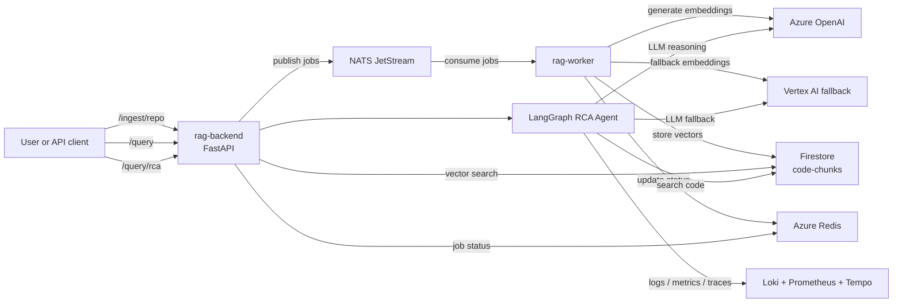

# rag-platform-app

English version. Version francaise: [README.fr.md](./README.fr.md)

Application code for the multi-cloud RAG (Retrieval-Augmented Generation) platform.

This repository contains:
- `rag-backend`: FastAPI API for ingest, query, and RCA
- `rag-worker`: NATS JetStream consumer for asynchronous ingestion

Infrastructure and Kubernetes manifests live in separate repositories:
- `rag-platform-infra`
- `rag-platform-gitops`

## Documentation

The technical documentation is available in both languages.

| Topic | English | Francais |
|---|---|---|
| Architecture | [docs/ARCHITECTURE.md](docs/ARCHITECTURE.md) | [docs/ARCHITECTURE.fr.md](docs/ARCHITECTURE.fr.md) |
| Step 1 - Request entry | [docs/01-request-entry.en.md](docs/01-request-entry.en.md) | [docs/01-request-entry.md](docs/01-request-entry.md) |
| Step 2 - NATS publish | [docs/02-nats-publish.en.md](docs/02-nats-publish.en.md) | [docs/02-nats-publish.md](docs/02-nats-publish.md) |
| Step 3 - Worker pipeline | [docs/03-worker-pipeline.en.md](docs/03-worker-pipeline.en.md) | [docs/03-worker-pipeline.md](docs/03-worker-pipeline.md) |
| Step 4 - Vector query | [docs/04-query-vector.en.md](docs/04-query-vector.en.md) | [docs/04-query-vector.md](docs/04-query-vector.md) |
| Step 5 - RCA agent | [docs/05-rca-agent.en.md](docs/05-rca-agent.en.md) | [docs/05-rca-agent.md](docs/05-rca-agent.md) |
| Phase 6 - MCP future | [docs/06-mcp-future.en.md](docs/06-mcp-future.en.md) | [docs/06-mcp-future.md](docs/06-mcp-future.md) |

## Runtime architecture

A clearer runtime diagram is available in [docs/ARCHITECTURE.md](docs/ARCHITECTURE.md).



## Where the RCA agent gets logs, metrics, and traces

The RCA agent does not read logs, metrics, or traces from buckets, PVCs, or raw databases directly.

It queries the observability backends through their HTTP APIs:
- logs: Loki HTTP API with LogQL, via `backend/agent/tools/loki.py`
- metrics: Prometheus HTTP API with PromQL, via `backend/agent/tools/prometheus.py`
- traces: Tempo HTTP API, via `backend/agent/tools/tempo.py`

In the current AKS deployment, those services run in the `otel-demo` namespace. The agent talks to the observability systems, not to their underlying storage layer.

### Physical storage in the current cluster

What is physically stored where is a separate question from which API the agent calls.

Cluster verification on 2026-04-13 showed:
- Prometheus data is stored in the `otel-demo-prometheus-server` pod under `--storage.tsdb.path=/data`
- that `/data` path is backed by an `EmptyDir` volume, not a PVC
- there are no PVCs or StatefulSets in the `otel-demo` namespace for the currently visible observability workloads

So, in the current environment, Prometheus metrics are physically stored on ephemeral node-backed pod storage and are lost if the pod is recreated.

For Loki and Tempo:
- the backend is configured to call `otel-demo-loki` and `otel-demo-tempo`
- those services were not present in the namespace at the time of verification
- because of that, their physical storage mode could not be confirmed from running workloads during this check

## Why this design

- Event-driven ingestion: the backend publishes jobs to NATS and returns immediately.
- Decoupled processing: the worker handles clone, parse, chunk, embed, and store asynchronously.
- Multi-cloud setup: Azure OpenAI for LLM and embeddings, Firestore for vector search, Vertex AI as fallback.
- RCA workflow: the LangGraph agent combines code search with live observability evidence.
- GitOps-friendly deployment: application code stays here, manifests stay in `rag-platform-gitops`.

## Repository structure

```text
rag-platform-app/
|-- backend/
|-- worker/
|-- docs/
|-- scripts/
|-- catalog.yaml
|-- CONTEXT.md
|-- .github/workflows/
|-- package.json
`-- CHANGELOG.md
```

## CI/CD

```text
Pull request -> ci.yml
  -> lint
  -> docker build (no push)
  -> Trivy
  -> CodeQL

Push to main -> release.yml
  -> semantic-release
  -> build and push ghcr.io/kheuchi/rag-backend
  -> build and push ghcr.io/kheuchi/rag-worker
  -> sign images + generate SBOM
```

## Local development

```bash
cd backend
pip install -r requirements.txt
uvicorn main:app --reload

cd worker
pip install -r requirements.txt
python main.py

docker run -p 4222:4222 nats:latest -js
```

## Current status

- Phase 4.5d: done
- Phase 4.6: next target, validate Vertex AI fallback
- Phase 5: pending
- Phase 6: planned
