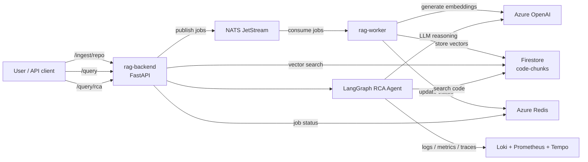

# rag-platform-app

Application code for the multi-cloud RAG (Retrieval-Augmented Generation) platform.

This repo contains the **backend API** and **worker** microservices. Infrastructure and Kubernetes manifests live in separate repos (`rag-platform-infra` and `rag-platform-gitops`).

## Architecture

A clearer runtime diagram is available in [docs/ARCHITECTURE.md](/C:/Users/cheik/OneDrive/Old%20OneDrive/Documents/code/mon-rag-multicloud/rag-platform-app/docs/ARCHITECTURE.md).



### Why this design?

- **Event-driven ingestion**: NATS JetStream decouples the API from heavy processing (chunking, embedding, vector upsert). The backend responds instantly while the worker processes asynchronously.
- **KEDA autoscaling**: The worker scales from 0 to N based on NATS queue depth — no documents = no pods = no cost.
- **Multi-cloud**: Azure OpenAI for embeddings/LLM, GCP Firestore as vector store, connected via Workload Identity Federation (no static keys).
- **RAG + RCA agent**: The LangGraph agent combines code vector search with live observability tools (Loki logs, Prometheus metrics, Tempo traces) for root cause analysis.
- **Why RAG over MCP?** Semantic search across multiple repos at scale (MCP reads files one by one — doesn't scale). Phase 6 will add MCP for live code navigation alongside RAG.
- **Why Firestore over BigQuery?** Millisecond latency for real-time vector search. BigQuery is an analytics warehouse with multi-second latency, unsuitable for a live API behind an SSE-streaming agent.
- **Separation of concerns**: This repo is pure application code. Kubernetes manifests live in `rag-platform-gitops` (GitOps). Infrastructure (AKS, VNet, Crossplane) lives in `rag-platform-infra` (Terraform).

## Repository structure

```
rag-platform-app/
├── backend/                  # FastAPI REST API
│   ├── main.py               # App entrypoint — /health, /ingest, /query, /query/rca
│   ├── config.py             # Pydantic settings (env vars)
│   ├── llm/                  # LLM + embedding clients
│   │   ├── embeddings.py     # Azure OpenAI / Vertex AI embeddings
│   │   └── chat.py           # Chat LLM (gpt-4o + gemini fallback)
│   ├── agent/                # LangGraph RCA agent
│   │   ├── graph.py          # Agent flow: plan → search → correlate → synthesize
│   │   └── tools/            # Agent tools (code_search, loki, prometheus, tempo)
│   ├── requirements.txt
│   └── Dockerfile
├── worker/                   # NATS JetStream consumer
│   ├── main.py               # Consumer loop — subscribe, process, ack
│   ├── config.py             # Worker settings
│   ├── pipeline/             # Ingestion pipeline
│   │   ├── chunk.py          # CodeSplitter (tree-sitter) + SentenceSplitter
│   │   ├── embed.py          # Azure OpenAI text-embedding-3-small (batch 16)
│   │   └── store.py          # GCP Firestore batch upsert
│   ├── requirements.txt
│   └── Dockerfile
├── scripts/
│   └── smoke-test.sh         # e2e smoke test script
├── catalog.yaml              # Centralized service catalog (CMDB)
├── CONTEXT.md                # Project context (synced across 3 repos)
├── .github/
│   └── workflows/
│       ├── ci.yml            # PR checks: lint + Docker build + Trivy + CodeQL
│       └── release.yml       # Main: semantic-release → build + push + sign + SBOM
├── .releaserc.json           # semantic-release config
├── package.json              # Node deps for semantic-release
└── CHANGELOG.md              # Auto-generated by semantic-release
```

## CI/CD pipeline

```
PR → ci.yml ──────────────────────────> lint + docker build (no push)

main push → release.yml
  ├── semantic-release ──────────────> version bump + CHANGELOG + GitHub Release
  └── docker (if new version) ───────> build + push to ghcr.io
        ├── ghcr.io/kheuchi/rag-backend:1.0.0
        ├── ghcr.io/kheuchi/rag-backend:1.0
        ├── ghcr.io/kheuchi/rag-backend:latest
        ├── ghcr.io/kheuchi/rag-worker:1.0.0
        ├── ghcr.io/kheuchi/rag-worker:1.0
        └── ghcr.io/kheuchi/rag-worker:latest
```

Images are tagged with semver (`1.0.0`, `1.0`, `latest`). The GitOps repo references `latest` in dev and pinned versions in prod.

## How it fits in the platform

| Repo | Role | Tool |
|---|---|---|
| `rag-platform-infra` | Cloud infrastructure (AKS, VNet, WIF) | Terraform + Crossplane |
| `rag-platform-gitops` | Kubernetes manifests, ArgoCD apps | ArgoCD + ApplicationSet |
| `rag-platform-app` (this repo) | Application code + Docker images | GitHub Actions + GHCR |

## Local development

```bash
# Backend
cd backend
pip install -r requirements.txt
uvicorn main:app --reload

# Worker (requires NATS running locally)
cd worker
pip install -r requirements.txt
python main.py

# Run NATS locally
docker run -p 4222:4222 nats:latest -js
```

## Conventional commits

This project uses [Conventional Commits](https://www.conventionalcommits.org/) with [semantic-release](https://semantic-release.gitbook.io/):

- `feat:` — new feature → minor version bump
- `fix:` — bug fix → patch version bump
- `feat!:` or `BREAKING CHANGE:` — breaking change → major version bump

## Roadmap

- [x] Phase 3: Backend + Worker scaffolding, NATS integration
- [x] Phase 4.1-4.4: FastAPI backend, LangGraph RCA agent, worker pipeline
- [x] Phase 4.5c: Swap Azure AI Search → GCP Firestore vector store
- [ ] Phase 4.5d: e2e smoke test (in progress — see CONTEXT.md for blockers)
- [ ] Phase 4.6: Multi-cloud validation (Vertex AI LLM fallback)
- [ ] Phase 5: Observability (Langfuse tracing, Kubecost)
- [ ] Phase 6: Hybrid RAG + MCP (live code navigation via MCP servers)
