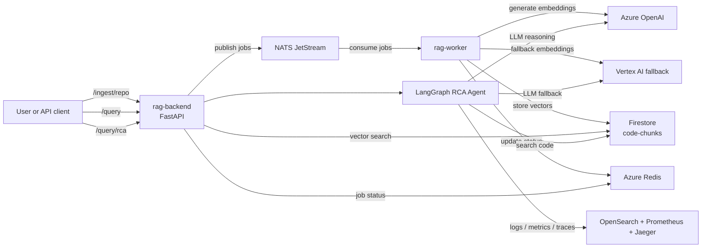

# rag-platform-app

English version. Version francaise: [README.fr.md](./README.fr.md)

Application code for the multi-cloud RAG (Retrieval-Augmented Generation) platform.

This repository contains:
- `rag-backend`: FastAPI API for ingest, query, and RCA
- `rag-worker`: NATS JetStream consumer for asynchronous ingestion

Infrastructure and Kubernetes manifests live in separate repositories:
- `rag-platform-infra`
- `rag-platform-gitops`

## Documentation

The technical documentation is available in both languages.

| Topic | English | Francais |
|---|---|---|
| Architecture | [docs/ARCHITECTURE.md](docs/ARCHITECTURE.md) | [docs/ARCHITECTURE.fr.md](docs/ARCHITECTURE.fr.md) |
| Step 1 - Request entry | [docs/01-request-entry.en.md](docs/01-request-entry.en.md) | [docs/01-request-entry.md](docs/01-request-entry.md) |
| Step 2 - NATS publish | [docs/02-nats-publish.en.md](docs/02-nats-publish.en.md) | [docs/02-nats-publish.md](docs/02-nats-publish.md) |
| Step 3 - Worker pipeline | [docs/03-worker-pipeline.en.md](docs/03-worker-pipeline.en.md) | [docs/03-worker-pipeline.md](docs/03-worker-pipeline.md) |
| Step 4 - Vector query | [docs/04-query-vector.en.md](docs/04-query-vector.en.md) | [docs/04-query-vector.md](docs/04-query-vector.md) |
| Step 5 - RCA agent | [docs/05-rca-agent.en.md](docs/05-rca-agent.en.md) | [docs/05-rca-agent.md](docs/05-rca-agent.md) |
| Phase 6 - MCP future | [docs/06-mcp-future.en.md](docs/06-mcp-future.en.md) | [docs/06-mcp-future.md](docs/06-mcp-future.md) |
| Current `otel-demo` state | [docs/07-otel-demo-current-state.en.md](docs/07-otel-demo-current-state.en.md) | [docs/07-otel-demo-current-state.md](docs/07-otel-demo-current-state.md) |
| Metrics follow-up | [docs/08-metrics-follow-up.en.md](docs/08-metrics-follow-up.en.md) | [docs/08-metrics-follow-up.md](docs/08-metrics-follow-up.md) |
| API reference | [docs/09-api-reference.en.md](docs/09-api-reference.en.md) | [docs/09-api-reference.md](docs/09-api-reference.md) |
| ADR - Production RAG retrieval | [docs/10-adr-production-rag-retrieval.md](docs/10-adr-production-rag-retrieval.md) | [docs/10-adr-production-rag-retrieval.md](docs/10-adr-production-rag-retrieval.md) |

## Runtime architecture

A clearer runtime diagram is available in [docs/ARCHITECTURE.md](docs/ARCHITECTURE.md).



## Where the RCA agent gets logs, metrics, and traces

The RCA agent does not read logs, metrics, or traces from buckets, PVCs, or raw databases directly.

It queries the observability backends through their HTTP APIs:
- logs: OpenSearch HTTP API, via `backend/agent/tools/opensearch.py`
- metrics: Prometheus HTTP API with PromQL, via `backend/agent/tools/prometheus.py`
- traces: Jaeger HTTP API, via `backend/agent/tools/jaeger.py`

In the current AKS deployment, those services run in the `otel-demo` namespace. The agent talks to the observability systems, not to their underlying storage layer.

### Physical storage in the current cluster

What is physically stored where is a separate question from which API the agent calls.

Cluster verification on 2026-04-13 showed:
- Prometheus data is stored in the `otel-demo-prometheus-server` pod under `--storage.tsdb.path=/data`
- that `/data` path is backed by an `EmptyDir` volume, not a PVC
- there are no PVCs or StatefulSets in the `otel-demo` namespace for the currently visible observability workloads

So, in the current environment, Prometheus metrics are physically stored on ephemeral node-backed pod storage and are lost if the pod is recreated.

For OpenSearch and Jaeger:
- the OpenTelemetry demo stack is configured to route logs to OpenSearch and traces to Jaeger
- those backends were misaligned or missing from the live namespace during the 2026-04-14 verification
- the application and GitOps repos are now aligned on `OpenSearch + Prometheus + Jaeger`; deployment sync is still required for the cluster to match that desired state

## Why this design

- Event-driven ingestion: the backend publishes jobs to NATS and returns immediately.
- Decoupled processing: the worker handles clone, parse, chunk, embed, and store asynchronously.
- Multi-cloud setup: Azure OpenAI for LLM and embeddings, Firestore for vector search, Vertex AI as fallback.
- Provider controls: the backend and worker now support `fallback` and explicit `switch` modes for Azure OpenAI vs Vertex AI.
- RCA workflow: the LangGraph agent combines code search with live observability evidence.
- GitOps-friendly deployment: application code stays here, manifests stay in `rag-platform-gitops`.

## Repository structure

```text
rag-platform-app/
|-- backend/
|-- worker/
|-- docs/
|-- scripts/
|-- catalog.yaml
|-- CONTEXT.md
|-- .github/workflows/
|-- package.json
`-- CHANGELOG.md
```

## CI/CD

```text
Pull request -> ci.yml
  -> lint
  -> docker build (no push)
  -> Trivy
  -> CodeQL

Push to main -> release.yml
  -> semantic-release
  -> build and push ghcr.io/kheuchi/rag-backend
  -> build and push ghcr.io/kheuchi/rag-worker
  -> sign images + generate SBOM
```

## Local development

```bash
cd backend
pip install -r requirements.txt
uvicorn main:app --reload

cd worker
pip install -r requirements.txt
python main.py

docker run -p 4222:4222 nats:latest -js
```

## API Docs

FastAPI generates the API spec automatically from the backend routes.

When the backend is reachable, use:
- `/openapi.json` for the OpenAPI spec
- `/docs` for Swagger UI
- `/redoc` for ReDoc

Endpoint reference:
- [docs/09-api-reference.en.md](docs/09-api-reference.en.md)
- [docs/09-api-reference.md](docs/09-api-reference.md)

## Current status

- Phase 4.5d: done, with an RCA MVP validated on `code + logs + traces`
- Metrics remain a dedicated follow-up item
- Phase 4.6: `switch` is implemented and tested locally; live fallback validation is still pending

## Provider Strategy

The runtime now supports two provider strategies:
- `fallback`: Azure OpenAI first, Vertex AI only on error
- `switch`: force the provider selection without waiting for an error

Environment variables:
- `LLM_PROVIDER_STRATEGY=fallback|switch`
- `LLM_SWITCH_PROVIDER=azure|vertex`
- `EMBEDDING_PROVIDER_STRATEGY=fallback|switch`
- `EMBEDDING_SWITCH_PROVIDER=azure|vertex`

Example to force Azure in `rag-dev`:

```env
LLM_PROVIDER_STRATEGY=switch
LLM_SWITCH_PROVIDER=azure
EMBEDDING_PROVIDER_STRATEGY=switch
EMBEDDING_SWITCH_PROVIDER=azure
```

Validation status on 2026-04-14:
- `switch` selection is covered by unit tests
- live `switch=vertex` routing is validated in cluster: backend and worker both select Vertex
- the Vertex AI API is now enabled on `mon-rag-perso-2026`
- the pod service account now has `roles/aiplatform.user`
- live Vertex embeddings now answer successfully
- `/query` still fails because the current Firestore vector index expects 1536 dimensions while the tested Vertex embedding path produces 768
- `/query/rca` still fails because the configured Vertex chat model `gemini-1.5-pro` is not available or not accessible on this project
- `rag-dev` has been switched back to Azure for stability while these blockers remain
- live fallback-on-error has not been validated yet
- Phase 5: pending
- Phase 6: planned
