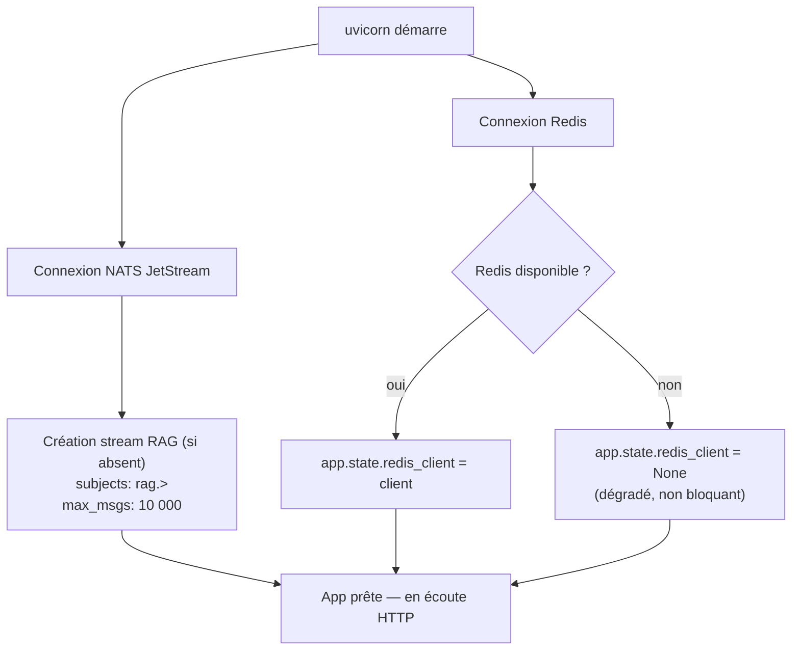
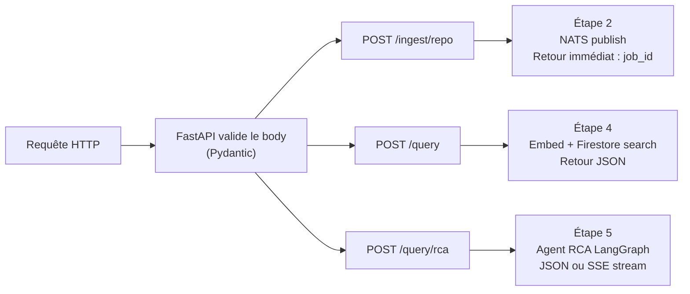

# Étape 1 — Réception de la requête (FastAPI backend)

> Flux complet : **[Étape 1]** → [Étape 2](./02-nats-publish.md) → [Étape 3](./03-worker-pipeline.md) → [Étape 4](./04-query-vector.md) → [Étape 5](./05-rca-agent.md)

---

## 0. Pydantic — c'est quoi ?

Pydantic est une librairie Python qui permet de **décrire la forme attendue d'une donnée** et de la **valider automatiquement**, en s'appuyant sur les types Python.

Dans ce projet, elle est utilisée à deux endroits distincts :

**1. Validation des requêtes HTTP** (dans les routers)

```python
class RepoIngestRequest(BaseModel):
    repo_url: str
    branch: str = "main"
    services: list[str] = []
```

Quand un client envoie `POST /ingest/repo`, FastAPI lit le body JSON et le passe à ce modèle. Si `repo_url` est absent, ou si `services` n'est pas une liste → FastAPI répond `422 Unprocessable Entity` automatiquement, sans que tu écrives une seule ligne de validation.

**2. Configuration via variables d'environnement** (`pydantic-settings`)

```python
class Settings(BaseSettings):
    nats_url: str = "nats://localhost:4222"
    redis_port: int = 6380
```

`BaseSettings` lit les variables d'environnement (`NATS_URL`, `REDIS_PORT`) et les convertit au bon type Python. Si `REDIS_PORT` est la string `"6380"` dans l'env → elle devient l'`int` `6380` en Python. Sans Pydantic, tu ferais ça manuellement avec `os.environ.get()` + `int()` partout.

**En résumé :** Pydantic = validation et parsing de données typées. FastAPI est entièrement construit dessus.

---

## Vue d'ensemble

Tout commence dans `backend/main.py`. C'est le point d'entrée unique du backend.  
Le backend expose **3 routes fonctionnelles** + `/health` :

| Route | Rôle |
|-------|------|
| `POST /ingest/repo` | Déclenche l'ingestion d'un repo Git entier (cold path) |
| `POST /ingest` | Ingestion d'un document unique (legacy, backward compat) |
| `GET /ingest/status/{job_id}` | Statut d'un job d'ingestion (via Redis) |
| `POST /query` | Recherche vectorielle directe dans Firestore |
| `POST /query/rca` | Lance l'agent LangGraph RCA (multi-étapes, SSE streaming) |
| `GET /health` | Healthcheck Kubernetes |

---

## 1.1 Démarrage de l'application (lifespan)

> `backend/main.py`

Le backend utilise le mécanisme `lifespan` de FastAPI pour ouvrir et fermer les connexions proprement.

```python
@asynccontextmanager
async def lifespan(app: FastAPI):
    # ── Startup ──────────────────────────────────────────────
    app.state.nc = await nats.connect(settings.nats_url)
    js = app.state.nc.jetstream()
    await js.add_stream(name="RAG", subjects=["rag.>"], max_msgs=10_000)

    app.state.redis_client = redis.Redis(
        host=settings.redis_host,
        port=settings.redis_port,
        ...
    )
    await app.state.redis_client.ping()

    yield  # ← l'app tourne ici

    # ── Shutdown ─────────────────────────────────────────────
    await app.state.nc.close()
    await app.state.redis_client.close()
```

Ce qui se passe au démarrage, dans l'ordre :



**Point important :** les deux connexions sont **best-effort**. Si NATS ou Redis est down au démarrage, l'app tourne quand même — elle retournera `503` sur les routes qui en ont besoin, mais `/health` reste `200`. C'est voulu pour la résistance aux redémarrages partiels du cluster.

---

## 1.2 Configuration (env vars → Pydantic)

> `backend/config.py`

Toute la configuration vient des variables d'environnement, lues via `pydantic-settings`.

```python
class Settings(BaseSettings):
    nats_url: str = "nats://localhost:4222"

    redis_host: str = "localhost"
    redis_port: int = 6380
    redis_key: str = ""

    azure_openai_endpoint: str = ""
    azure_openai_api_key: str = ""
    azure_openai_chat_deployment: str = "gpt-4o"
    azure_openai_embedding_deployment: str = "text-embedding-3-small"

    firestore_database: str = "(default)"
    firestore_collection: str = "code-chunks"

    gcp_project_id: str = ""
    gcp_location: str = "us-central1"

    loki_url: str = "http://loki:3100"
    prometheus_url: str = "http://prometheus:9090"
    tempo_url: str = "http://tempo:3200"

    model_config = {"env_file": ".env", "extra": "ignore"}
```

Dans le cluster AKS (namespace `rag-dev`), ces variables sont injectées par le **Deployment Kubernetes** depuis deux sources :

| Source K8s | Variables |
|---|---|
| Secret `rag-ai-secrets` | `AZURE_OPENAI_ENDPOINT`, `AZURE_OPENAI_API_KEY` |
| Secret `rag-backend-secrets` | `REDIS_HOST`, `REDIS_KEY` |
| ConfigMap / env directs | `NATS_URL`, `GCP_PROJECT_ID`, `FIRESTORE_*`, `LOKI_URL`, etc. |

En local : un fichier `.env` à la racine de `backend/` suffit (jamais commité).

---

## 1.3 Routing — comment une requête est dirigée

> `backend/main.py` → `backend/routers/ingest.py`, `backend/routers/query.py`

L'app enregistre deux routers à l'initialisation :

```python
app.include_router(ingest_router)   # /ingest, /ingest/repo, /ingest/status/{job_id}
app.include_router(query_router)    # /query, /query/rca
```

Chaque router est défini dans son fichier dédié :

```
backend/
├── routers/
│   ├── ingest.py   → POST /ingest, POST /ingest/repo, GET /ingest/status/{job_id}
│   └── query.py    → POST /query, POST /query/rca
```

---

## 1.4 Validation des requêtes entrantes (Pydantic models)

> `backend/routers/ingest.py`, `backend/routers/query.py`

FastAPI valide automatiquement le body JSON via des modèles Pydantic définis dans chaque router.

### `/ingest/repo` — RepoIngestRequest

```python
# backend/routers/ingest.py
class RepoIngestRequest(BaseModel):
    repo_url: str                          # URL Git (ex: https://github.com/...)
    branch: str = "main"                   # Branche à cloner
    services: list[str] = []               # Filtre optionnel (ex: ["checkoutservice"])
    file_patterns: list[str] = [           # Patterns de fichiers à indexer
        "**/*.py", "**/*.go",
        "**/*.java", "**/*.ts"
    ]
```

Si un champ requis manque ou a le mauvais type → FastAPI répond `422 Unprocessable Entity` sans jamais atteindre le handler.

### `/query` — QueryRequest

```python
class QueryRequest(BaseModel):
    query: str                             # La question en langage naturel
    top_k: int = 5                         # Nombre de chunks retournés
    service_filter: str | None = None      # Filtre sur un service spécifique
```

### `/query/rca` — RCAQueryRequest

```python
class RCAQueryRequest(BaseModel):
    question: str                          # Question pour l'agent RCA
    service: str | None = None             # Service ciblé (ex: "checkoutservice")
    time_range: str = "1h"                 # Fenêtre temporelle pour logs/metrics/traces
    stream: bool = False                   # True → réponse SSE, False → JSON sync
```

---

## 1.5 Accès aux connexions dans les handlers

> `backend/routers/ingest.py`, `backend/routers/query.py`

Les connexions NATS et Redis sont stockées sur `app.state` (initialisées dans le lifespan).  
Les handlers y accèdent via l'objet `Request` injecté par FastAPI :

```python
@router.post("/ingest/repo")
async def ingest_repo(req: RepoIngestRequest, request: Request):
    nc = request.app.state.nc          # connexion NATS
    redis_client = request.app.state.redis_client  # connexion Redis
```

Pour les routes query (pas de NATS), les clients LLM et Firestore sont instanciés à la demande dans les tools/agents (pas sur `app.state`), car ils sont stateless.

---

## 1.6 Ce qui se passe selon la route appelée



À ce stade, le backend **n'a pas encore traité** le code source.  
Il a seulement reçu, validé, et routé la requête.

---

## Résumé de l'étape 1

| Composant | Rôle | Fichier |
|---|---|---|
| `lifespan` | Connexions NATS + Redis au démarrage | `backend/main.py` |
| `Settings` | Lecture env vars → config typée | `backend/config.py` |
| `ingest_router` | Routes `/ingest*` | `backend/routers/ingest.py` |
| `query_router` | Routes `/query*` | `backend/routers/query.py` |
| Pydantic models | Validation body HTTP | dans chaque router |

---

**Étape suivante →** [Étape 2 — Publication dans NATS JetStream](./02-nats-publish.md)
