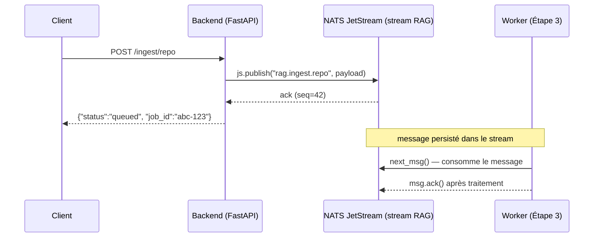
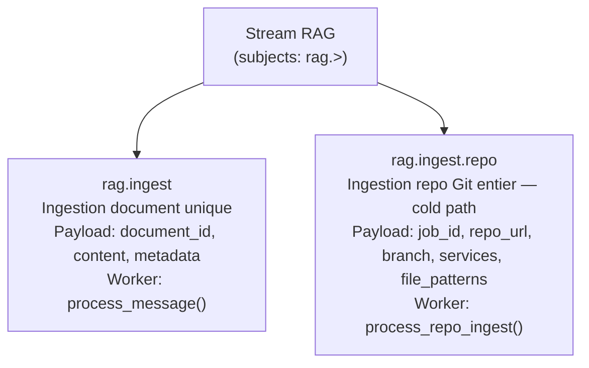
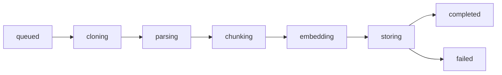

# Étape 2 — Publication dans NATS JetStream

Version francaise. English version: [02-nats-publish.en.md](./02-nats-publish.en.md)

> Flux complet : [Étape 1](./01-request-entry.md) → **[Étape 2]** → [Étape 3](./03-worker-pipeline.md) → [Étape 4](./04-query-vector.md) → [Étape 5](./05-rca-agent.md)

---

## 2.0 C'est quoi un stream ?

Un **stream** (dans NATS JetStream) est un **journal de messages persisté sur disque**, auquel des producteurs publient et des consommateurs s'abonnent.

À la différence d'un simple pub/sub (fire-and-forget) :

| Pub/sub classique | Stream JetStream |
|---|---|
| Si le consommateur est absent → message perdu | Messages stockés jusqu'à ce qu'un consommateur les ack |
| Pas de replay | Replay depuis n'importe quel offset |
| Pas de retry | `nak()` → message renvoyé après un délai |
| Pas d'historique | Historique configurable (par temps ou nombre de messages) |

Dans ce projet, le stream s'appelle **`RAG`**. Le backend y publie des jobs. Le worker les consomme. Si le worker est down (pod qui redémarre, scale-to-zero), les messages attendent dans le stream — ils ne sont pas perdus.

---

## Vue d'ensemble

Après validation de la requête (étape 1), le backend **publie un message dans NATS JetStream** et répond immédiatement au client avec un `job_id`. L'ingestion réelle (clone, chunk, embed, store) se passe **dans le worker, de façon asynchrone**.



Le backend ne sait pas quand le worker va traiter. Il ne sait pas si ça va réussir. Le client doit utiliser `GET /ingest/status/{job_id}` pour suivre l'avancement.

---

## 2.1 Pourquoi NATS JetStream et pas un appel direct ?

Sans NATS, le backend devrait cloner le repo, parser, chunker, embedder (appels Azure OpenAI), et stocker dans Firestore — **tout ça dans le handler HTTP**. Ça prendrait plusieurs minutes. Le client timeouterait.

NATS découple le déclenchement du traitement :

| Sans NATS | Avec NATS JetStream |
|-----------|---------------------|
| Le client attend 2-5 min | Le client reçoit une réponse en ~5ms |
| Si le backend redémarre → job perdu | Le message est persisté dans JetStream — relivré au redémarrage |
| Pas de parallélisation | KEDA scale le worker selon le nombre de messages en attente |
| Pas de retry | JetStream rejette le message (nak) → retry automatique |

---

## 2.2 Le stream "RAG" — ce qui est configuré au démarrage

> `backend/main.py` — fonction `lifespan`

Au démarrage du backend, le stream est créé s'il n'existe pas :

```python
# backend/main.py
js = app.state.nc.jetstream()
await js.add_stream(name="RAG", subjects=["rag.>"], max_msgs=10_000)
```

| Paramètre | Valeur | Signification |
|-----------|--------|---------------|
| `name` | `"RAG"` | Nom du stream dans NATS |
| `subjects` | `["rag.>"]` | Wildcard — capture tout ce qui commence par `rag.` |
| `max_msgs` | `10 000` | Limite de messages stockés (après : les plus anciens sont supprimés) |

Le `>` est le wildcard NATS "tout ce qui suit". Donc `rag.>` couvre :
- `rag.ingest` — ingestion document unique
- `rag.ingest.repo` — ingestion repo entier
- Toute future extension (`rag.reindex`, `rag.delete`, etc.)

---

## 2.3 Publication d'un job repo — `/ingest/repo`

> `backend/routers/ingest.py` — fonction `ingest_repo`

```python
# backend/routers/ingest.py
@router.post("/ingest/repo")
async def ingest_repo(req: RepoIngestRequest, request: Request):
    nc = request.app.state.nc
    if not nc or nc.is_closed:
        raise HTTPException(503, "NATS not connected")

    job_id = str(uuid.uuid4())          # ① ID unique généré côté backend

    payload = json.dumps({              # ② Sérialisation en JSON
        "job_id": job_id,
        "repo_url": req.repo_url,
        "branch": req.branch,
        "services": req.services,
        "file_patterns": req.file_patterns,
    }).encode()                         #    → bytes (NATS transporte des bytes)

    js = nc.jetstream()
    ack = await js.publish(             # ③ Publication dans JetStream
        "rag.ingest.repo",              #    subject ciblé
        payload
    )
    # ack.seq = numéro de séquence attribué par NATS (preuve de persistance)

    return {
        "status": "queued",
        "job_id": job_id,
        "seq": ack.seq,
    }
```

**Les 3 opérations clés :**

```
① uuid.uuid4()
    → ID aléatoire unique (ex: "f3a2c1d4-8b5e-4f7a-9c2d-1e3b5a7f9c0d")
    → Le client l'utilise pour GET /ingest/status/{job_id}
    → Le worker le stocke dans Redis pour tracer l'avancement

② json.dumps(...).encode()
    → Le payload voyage dans NATS comme bytes bruts
    → Le worker fait json.loads(msg.data.decode()) pour reconstituer le dict

③ js.publish("rag.ingest.repo", payload)
    → Publication dans le stream RAG, sur le subject "rag.ingest.repo"
    → JetStream confirme avec un ack contenant le numéro de séquence
    → Si NATS est down → exception → le client reçoit 503
```

---

## 2.4 Les deux subjects et leur rôle



`rag.ingest` est la route legacy (document déjà parsé, contenu envoyé directement).  
`rag.ingest.repo` est la route principale utilisée aujourd'hui — le worker fait tout le travail.

---

## 2.5 Persistance et garanties JetStream

NATS **JetStream** (pas NATS core) ajoute la persistance. Différence cruciale :

| NATS Core (pub/sub classique) | NATS JetStream |
|-------------------------------|----------------|
| Fire-and-forget | Messages persistés sur disque |
| Si le worker est down → message perdu | Message stocké jusqu'à ack du consommateur |
| Pas de replay | Replay possible depuis le début du stream |
| Pas de retry | nak() → renvoi du message (avec délai configurable) |

Dans ce projet : si le worker est down (pod en cours de redémarrage, scale-to-zero), les messages attendent dans JetStream. Quand le worker redémarre, il reprend depuis là où il s'est arrêté — grâce au **durable consumer** (voir étape 3).

---

## 2.6 Suivi du statut — `/ingest/status/{job_id}`

> `backend/routers/ingest.py` — fonction `ingest_status` / `worker/main.py` — fonction `update_job_status`

Le client peut interroger le statut du job à tout moment :

```python
# backend/routers/ingest.py
@router.get("/ingest/status/{job_id}")
async def ingest_status(job_id: str, request: Request):
    redis_client = request.app.state.redis_client
    status = await redis_client.hgetall(f"ingest:job:{job_id}")
    return {
        "job_id": job_id,
        "status": status.get("status", "unknown"),   # cloning / parsing / chunking / embedding / storing / completed / failed
        "progress": float(status.get("progress", 0)), # 0.0 → 1.0
        "chunks_indexed": int(status.get("chunks_indexed", 0)),
        "error": status.get("error"),
    }
```

Le worker écrit dans Redis à chaque étape du pipeline (via `redis.hset`). Les statuts possibles :



Redis stocke ces données sous la clé `ingest:job:{job_id}` avec un TTL de 24h.

---

## 2.7 Ce que reçoit le worker

> `worker/main.py` — fonction `process_repo_ingest`

Le worker (étape 3) lit le message depuis JetStream. Il reçoit exactement le payload publié par le backend :

```python
# worker/main.py
data = json.loads(msg.data.decode())
job_id     = data.get("job_id")
repo_url   = data.get("repo_url")
branch     = data.get("branch", "main")
services   = data.get("services", [])
file_patterns = data.get("file_patterns", ["**/*.py", "**/*.go", ...])
```

Il ne sait pas que c'est le backend qui a publié. Il ne connaît que le message. C'est le découplage voulu.

---

## Résumé de l'étape 2

| Action | Où | Détail |
|--------|-----|--------|
| Génération `job_id` | `routers/ingest.py` | `uuid.uuid4()` — unique par job |
| Sérialisation payload | `routers/ingest.py` | `json.dumps().encode()` → bytes |
| Publication JetStream | `routers/ingest.py` | `js.publish("rag.ingest.repo", payload)` |
| Persistance message | NATS JetStream (cluster) | Stocké jusqu'à ack du worker |
| Suivi statut | Redis | Clé `ingest:job:{job_id}`, TTL 24h |
| Retour client | `routers/ingest.py` | `{"status": "queued", "job_id": "..."}` |

---

**Étape suivante →** [Étape 3 — Pipeline worker (clone → parse → chunk → embed → store)](./03-worker-pipeline.md)
