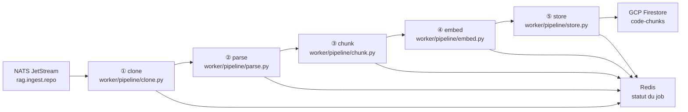
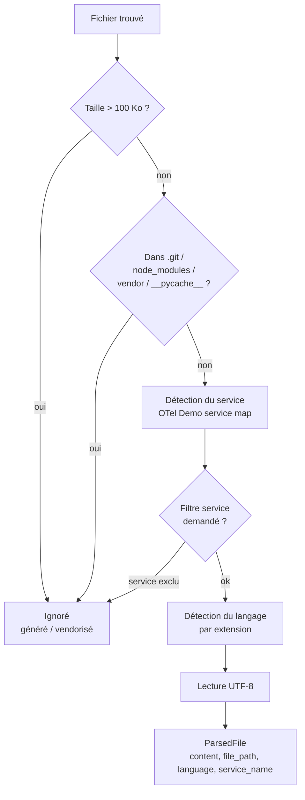
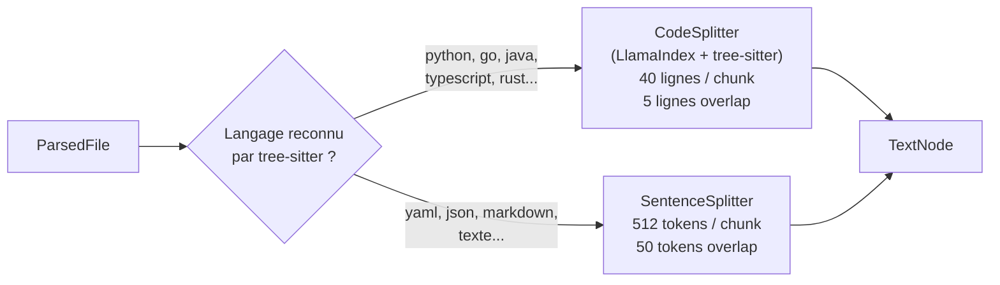
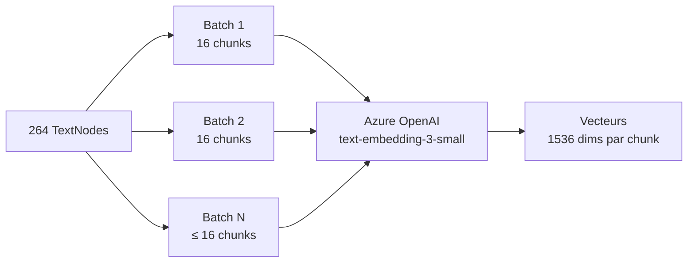

# Étape 3 — Pipeline worker (clone → parse → chunk → embed → store)

Version francaise. English version: [03-worker-pipeline.en.md](./03-worker-pipeline.en.md)

> Flux complet : [Étape 1](./01-request-entry.md) → [Étape 2](./02-nats-publish.md) → **[Étape 3]** → [Étape 4](./04-query-vector.md) → [Étape 5](./05-rca-agent.md)

---

## Vue d'ensemble

Le worker est un **processus Python indépendant** (pas dans le backend FastAPI). Il tourne dans son propre pod Kubernetes (`rag-worker`), autoscalé par KEDA selon le nombre de messages dans NATS.

Quand il reçoit un message `rag.ingest.repo`, il exécute un pipeline à 5 étapes séquentielles :



À chaque étape, le worker met à jour le statut dans Redis (`cloning` → `parsing` → `chunking` → `embedding` → `storing` → `completed`).

---

## 3.0 Le worker — démarrage et boucle principale

> `worker/main.py` — fonctions `main`, `subscribe_with_retry`, `process_repo_ingest`

```python
# worker/main.py
async def main():
    nc = await nats.connect(settings.nats_url)
    js = nc.jetstream()

    # Deux subscriptions durables
    sub_doc  = await subscribe_with_retry(js, "rag.ingest",      durable="rag-worker")
    sub_repo = await subscribe_with_retry(js, "rag.ingest.repo", durable="rag-worker-repo")

    while not shutdown_event.is_set():
        done, pending = await asyncio.wait(
            [sub_doc.next_msg(timeout=5), sub_repo.next_msg(timeout=5)],
            return_when=asyncio.FIRST_COMPLETED,
        )
        for task in done:
            msg = task.result()
            if msg.subject == "rag.ingest.repo":
                await process_repo_ingest(msg, redis_client)
            else:
                await process_message(msg)
```

**Durable consumer** : la subscription est nommée (`durable="rag-worker-repo"`). Ça signifie que NATS retient la position de lecture même si le worker redémarre — il reprend là où il s'était arrêté, sans re-recevoir les messages déjà ackés.

**subscribe_with_retry** : au redémarrage, le consumer durable peut être encore "lié" à l'ancienne subscription. Le worker attend et réessaie toutes les 5 secondes jusqu'à ce que NATS le libère.

---

## 3.1 Étape 1 — Clone

> `worker/pipeline/clone.py` — fonction `clone_repo`

```python
repo_dir = clone_repo(repo_url, branch)
```

```python
Repo.clone_from(
    repo_url,
    str(dest),
    branch=branch,
    depth=1,           # shallow clone — 1 seul commit, pas tout l'historique
    single_branch=True,
)
```

| Option | Valeur | Pourquoi |
|--------|--------|----------|
| `depth=1` | 1 commit | On ne veut que le code actuel, pas l'historique git → 10x plus rapide, moins de disque |
| `single_branch=True` | oui | Évite de cloner toutes les branches |
| `dest` | `tempfile.mkdtemp()` | Répertoire temporaire automatiquement nettoyé après le job |

Le repo est cloné dans `/tmp/rag-clone-XXXXXX/`. À la fin du job (dans le `finally`), ce répertoire est supprimé (`shutil.rmtree`).

---

## 3.2 Étape 2 — Parse

> `worker/pipeline/parse.py` — fonction `parse_files`

```python
parsed_files = parse_files(repo_dir, file_patterns, services or None)
```

Le parser **walk** le repo cloné et lit les fichiers correspondant aux patterns demandés (`**/*.py`, `**/*.go`, etc.).

**Ce qu'il fait par fichier :**



**Détection du service OTel Demo** :

```python
OTEL_DEMO_SERVICE_MAP = {
    "src/checkoutservice": "checkoutservice",
    "src/cartservice": "cartservice",
    "src/paymentservice": "paymentservice",
    # ... 15 services au total
}
```

Un fichier dans `src/checkoutservice/main.go` → `service_name = "checkoutservice"`.  
Un fichier hors de ces répertoires → `service_name = "unknown"`.

**Détection du langage** :

```python
EXTENSION_LANG_MAP = {
    ".py": "python", ".go": "go", ".java": "java",
    ".ts": "typescript", ".rs": "rust", ".cs": "csharp", ...
}
```

Utile à l'étape suivante pour choisir le bon splitter.

**Output :** liste de `ParsedFile` (dataclass : `content`, `file_path`, `language`, `service_name`, `metadata`).

---

## 3.3 Étape 3 — Chunk

> `worker/pipeline/chunk.py` — fonction `chunk_documents`

```python
nodes = chunk_documents(parsed_files, repo_url)
```

Le chunker découpe chaque fichier en **petits morceaux** (chunks) de ~512 tokens, avec 50 tokens de chevauchement entre chaque chunk. C'est nécessaire parce que les modèles d'embedding ont une limite de tokens en entrée, et parce qu'un chunk ciblé est plus utile qu'un fichier entier pour la recherche.

**Deux stratégies de découpe selon le langage :**



**CodeSplitter (tree-sitter)** — parse l'AST du code source et découpe sur les frontières syntaxiques (fonctions, classes, blocs). Les chunks correspondent à des unités de code cohérentes, pas à des coupures arbitraires au milieu d'une fonction.

**SentenceSplitter** — découpe sur les frontières de phrases / paragraphes. Utilisé pour les fichiers non-code ou si tree-sitter ne supporte pas le langage.

**ID déterministe par chunk :**

```python
def _make_chunk_id(repo_url: str, file_path: str, chunk_index: int) -> str:
    repo_hash = hashlib.sha256(repo_url.encode()).hexdigest()[:12]
    file_hash = hashlib.sha256(file_path.encode()).hexdigest()[:12]
    return f"{repo_hash}:{file_hash}:{chunk_index}"
```

L'ID est le même si on réindexe le même fichier au même endroit → Firestore fait un `set(merge=True)` → **upsert idempotent**, pas de doublons.

**Output :** liste de `TextNode` (LlamaIndex), chacun avec `text`, `metadata` (`file_path`, `service_name`, `language`, `repo_url`, `chunk_index`), et `id_`.

---

## 3.4 Étape 4 — Embed

> `worker/pipeline/embed.py` — fonction `embed_chunks`

```python
nodes = await embed_chunks(nodes)
```

Chaque chunk est transformé en **vecteur numérique** (embedding) de 1536 dimensions par Azure OpenAI `text-embedding-3-small`. Ce vecteur représente le sens sémantique du chunk — deux chunks similaires auront des vecteurs proches. → [Explication des dimensions](./04-query-vector.md#42-embedding-de-la-requête)

**Traitement par batch de 16 :**

```python
BATCH_SIZE = 16

for i in range(0, len(nodes), BATCH_SIZE):
    batch = nodes[i : i + BATCH_SIZE]
    texts = [node.get_content() for node in batch]

    embeddings = await embed_model.aget_text_embedding_batch(texts)

    for node, embedding in zip(batch, embeddings):
        node.embedding = embedding  # list[float] — 1536 valeurs
```



**Fallback Vertex AI :** si `AZURE_OPENAI_ENDPOINT` n'est pas configuré, le worker bascule sur `VertexAIEmbeddings` (`text-embedding-004` de Google). Même interface, même output.

**Pourquoi batch de 16 ?** L'API Azure OpenAI accepte plusieurs textes par appel. Batches de 16 = bon compromis entre nombre d'appels API (moins = plus rapide) et risque de rate limiting (429) sur le tier S0.

**Output :** les mêmes `TextNode`, mais avec `node.embedding` populé (`list[float]` de 1536 valeurs).

---

## 3.5 Étape 5 — Store

> `worker/pipeline/store.py` — fonction `store_chunks`

```python
chunks_indexed = store_chunks(nodes)
```

Les chunks avec leurs embeddings sont **upsertés dans GCP Firestore** (collection `code-chunks`).

**Conversion TextNode → document Firestore :**

```python
def _node_to_document(node: TextNode) -> dict:
    return {
        "content":      node.get_content(),          # texte du chunk
        "embedding":    Vector(node.embedding),       # vecteur 1536 dims — type natif Firestore
        "file_path":    node.metadata["file_path"],   # ex: "src/checkoutservice/main.go"
        "service_name": node.metadata["service_name"],# ex: "checkoutservice"
        "language":     node.metadata["language"],    # ex: "go"
        "chunk_index":  node.metadata["chunk_index"], # position dans le fichier
        "repo_url":     node.metadata["repo_url"],
        "commit_sha":   node.metadata["commit_sha"],
    }
```

**Upsert par batch de 500 :**

```python
UPLOAD_BATCH_SIZE = 500  # limite Firestore

for i in range(0, len(nodes), UPLOAD_BATCH_SIZE):
    batch = db.batch()
    for node in batch_nodes:
        doc_id = node.id_.replace(":", "-")   # IDs compatibles Firestore
        doc_ref = collection.document(doc_id)
        batch.set(doc_ref, _node_to_document(node), merge=True)  # upsert
    batch.commit()
```

`merge=True` → si le document existe déjà (même `doc_id`), il est mis à jour. Si non, il est créé. C'est l'**idempotence** : réindexer le même repo deux fois ne crée pas de doublons.

**Structure dans Firestore :**

```
Firestore (default)
└── collection: code-chunks
        └── document: abc123def456-789xyz012345-0
                ├── content: "func (s *checkoutService) PlaceOrder(...) {"
                ├── embedding: [0.0023, -0.0145, 0.0087, ...]  ← 1536 floats
                ├── file_path: "src/checkoutservice/main.go"
                ├── service_name: "checkoutservice"
                ├── language: "go"
                ├── chunk_index: 3
                └── repo_url: "https://github.com/open-telemetry/..."
```

**Output :** nombre de chunks upsertés (loggé + écrit dans Redis comme `chunks_indexed`).

---

## 3.6 Gestion des erreurs et retry

> `worker/main.py` — fonction `process_repo_ingest`

```python
async def process_repo_ingest(msg, redis_client):
    try:
        # ... pipeline ...
        await msg.ack()   # ✅ succès → NATS marque le message comme traité

    except Exception as e:
        await update_job_status(..., status="failed", error=str(e))
        await msg.nak(delay=30)   # ❌ échec → NATS relivrera le message après 30s

    finally:
        if repo_dir and repo_dir.exists():
            shutil.rmtree(repo_dir, ignore_errors=True)   # nettoyage du clone
```

| Cas | Action |
|-----|--------|
| Pipeline OK | `msg.ack()` — message retiré du stream |
| Exception (réseau, API, etc.) | `msg.nak(delay=30)` — message renvoyé après 30s |
| Timeout sans ack | JetStream relivré selon la config du consumer |

---

## Résumé de l'étape 3

| Étape | Fichier | Input | Output |
|-------|---------|-------|--------|
| ① Clone | `pipeline/clone.py` | `repo_url`, `branch` | `Path` (répertoire local) |
| ② Parse | `pipeline/parse.py` | `Path`, patterns, services | `list[ParsedFile]` |
| ③ Chunk | `pipeline/chunk.py` | `list[ParsedFile]` | `list[TextNode]` |
| ④ Embed | `pipeline/embed.py` | `list[TextNode]` | `list[TextNode]` + `.embedding` |
| ⑤ Store | `pipeline/store.py` | `list[TextNode]` avec embeddings | `int` chunks upsertés |

---

**Étape suivante →** [Étape 4 — Query vectorielle simple (`/query` → Firestore)](./04-query-vector.md)
