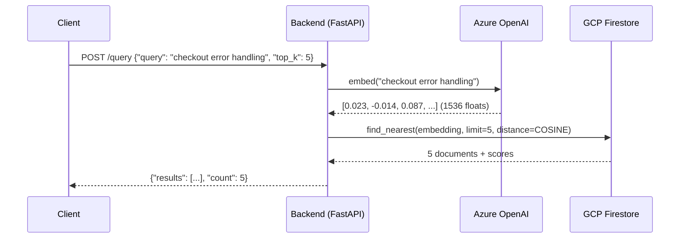
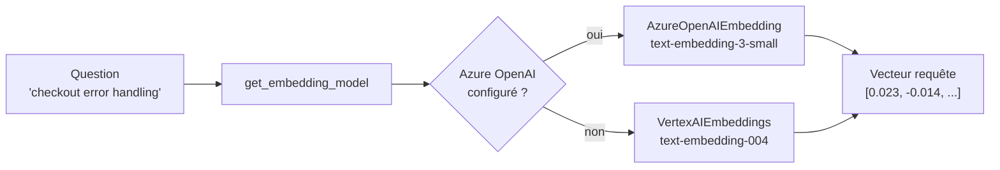
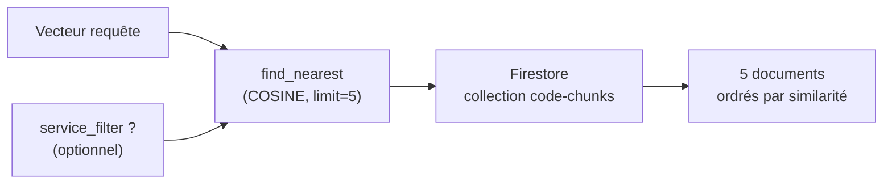

# Étape 4 — Query vectorielle simple (`/query`)

Version francaise. English version: [04-query-vector.en.md](./04-query-vector.en.md)

> Flux complet : [Étape 1](./01-request-entry.md) → [Étape 2](./02-nats-publish.md) → [Étape 3](./03-worker-pipeline.md) → **[Étape 4]** → [Étape 5](./05-rca-agent.md) → [Phase 6 — MCP](./06-mcp-future.md)

---

## Vue d'ensemble

`POST /query` est le chemin le plus court : pas de NATS, pas d'agent, pas de streaming.  
Le backend reçoit une question en langage naturel, l'embeds, cherche dans Firestore, et retourne les chunks les plus proches.



Tout se passe dans le même appel HTTP synchrone. Latence typique : 200-500ms (dominée par l'appel embedding Azure OpenAI).

---

## 4.1 Le handler HTTP

> `backend/routers/query.py` — fonction `query`

```python
@router.post("/query")
async def query(req: QueryRequest):
    results = await search_code_vectors.ainvoke({
        "query": req.query,
        "service_filter": req.service_filter,
        "top_k": req.top_k,
    })
    return {"results": results, "count": len(results)}
```

Le handler délègue entièrement à `search_code_vectors` — un tool LangChain réutilisé ici directement et dans l'agent RCA (étape 5). Pas de logique dans le router, pas d'état.

`.ainvoke()` est l'appel asynchrone du tool LangChain (équivalent à l'appeler directement, mais compatible avec le décorateur `@tool`).

---

## 4.2 Embedding de la requête

> `backend/agent/tools/code_search.py` — fonction `search_code_vectors`  
> `backend/llm/embeddings.py` — fonction `get_embedding_model`

La première opération est de transformer la question texte en vecteur — le même modèle que celui utilisé pour indexer les chunks. C'est crucial : **la question et les chunks doivent être dans le même espace vectoriel**.

**C'est quoi 1536 dimensions ?**

Un embedding transforme un texte en une liste de nombres flottants — un point dans un espace mathématique à N dimensions. `text-embedding-3-small` produit des vecteurs de **1536 nombres**.

Chaque dimension capture une facette sémantique abstraite du texte (le modèle apprend lui-même ce que représente chaque dimension — ce n'est pas interprétable humainement). Ce qui compte : deux textes au sens proche produiront des vecteurs qui pointent dans la même direction dans cet espace à 1536 dimensions.

```
"checkout error handling"  → [0.023, -0.014, 0.087, 0.002, -0.031, ...]  ← 1536 valeurs
"PlaceOrder failed payment" → [0.019, -0.011, 0.091, 0.005, -0.028, ...]  ← proche !
"kubernetes node affinity"  → [-0.045, 0.103, -0.012, 0.078,  0.044, ...]  ← loin
```

**Pourquoi 1536 et pas 512 ou 3072 ?** C'est la taille fixée par le modèle `text-embedding-3-small`. Plus il y a de dimensions, plus le modèle peut encoder de nuances — mais plus les index et le stockage sont coûteux. 1536 est le compromis choisi par OpenAI pour ce modèle "small". L'important : **question et chunks doivent avoir le même nombre de dimensions** pour que la comparaison soit possible.

```python
embed_model = get_embedding_model()
query_embedding = await embed_model.aget_text_embedding(query)
# → list[float] de 1536 valeurs
```

`get_embedding_model()` supporte maintenant deux modes :
- `fallback` : Azure OpenAI `text-embedding-3-small` en priorité, Vertex AI `text-embedding-004` sur erreur
- `switch` : sélection explicite Azure ou Vertex via variables d'environnement, comme dans le worker



---

## 4.3 Recherche vectorielle dans Firestore

> `backend/agent/tools/code_search.py` — fonction `search_code_vectors`

Firestore supporte nativement la recherche par similarité vectorielle via `find_nearest`.

```python
db = FirestoreClient(project=settings.gcp_project_id, database=settings.firestore_database)
collection = db.collection(settings.firestore_collection)  # "code-chunks"

# Filtre optionnel sur le service
query_ref = collection
if service_filter:
    query_ref = query_ref.where("service_name", "==", service_filter)

vector_query = query_ref.find_nearest(
    vector_field="embedding",        # champ vectoriel dans le document
    query_vector=Vector(query_embedding),
    distance_measure=DistanceMeasure.COSINE,
    limit=top_k,                     # top 5 par défaut
)
```

**Distance COSINE** — mesure l'angle entre deux vecteurs, pas leur distance euclidienne. Deux vecteurs pointant dans la même direction (même sens sémantique) auront un cosinus proche de 1, quelle que soit leur magnitude. C'est le standard pour les embeddings de texte.



**Pourquoi un filtre service ?** Sans filtre, Firestore cherche dans tous les chunks de tous les services. Avec `service_filter="checkoutservice"`, la recherche est restreinte aux fichiers de ce seul service — plus pertinent quand on diagnostique un service précis.

---

## 4.4 Format de la réponse

Les documents Firestore sont convertis en dicts Python et retournés directement :

```python
for doc in vector_query.get():
    data = doc.to_dict()
    results.append({
        "file_path":    data.get("file_path", ""),      # ex: "src/checkoutservice/main.go"
        "service_name": data.get("service_name", ""),   # ex: "checkoutservice"
        "language":     data.get("language", ""),       # ex: "go"
        "content":      data.get("content", ""),        # le code du chunk
        "score":        data.get("distance", 0),        # distance cosine
    })
```

Réponse HTTP finale :

```json
{
  "results": [
    {
      "file_path": "src/checkoutservice/main.go",
      "service_name": "checkoutservice",
      "language": "go",
      "content": "func (s *checkoutService) PlaceOrder(ctx context.Context, req *pb.PlaceOrderRequest) ...",
      "score": 0.08
    },
    ...
  ],
  "count": 5
}
```

Le `score` est la **distance cosine** (pas une similarité) — plus il est bas, plus le chunk est proche de la requête.

---

## 4.5 Indexes Firestore requis

La recherche vectorielle ne fonctionne pas sans index. Deux index ont été créés manuellement sur la collection `code-chunks` (Phase 4.5d) :

| Index | Champs | Utilisation |
|-------|--------|-------------|
| Vectoriel simple | `embedding` (1536 dims) | `/query` sans filtre service |
| Composite | `service_name` + `__name__` + `embedding` | `/query` avec `service_filter` |

Sans ces index, Firestore retourne `Missing vector index configuration`.

---

## Résumé de l'étape 4

| Opération | Fichier | Détail |
|-----------|---------|--------|
| Réception requête | `backend/routers/query.py` | Pydantic `QueryRequest`, délègue au tool |
| Embedding question | `backend/llm/embeddings.py` | Azure OpenAI → Vertex AI fallback, 1536 dims |
| Recherche vectorielle | `backend/agent/tools/code_search.py` | Firestore `find_nearest`, distance COSINE |
| Filtre service | `backend/agent/tools/code_search.py` | `where("service_name", "==", ...)` optionnel |
| Retour résultats | `backend/routers/query.py` | `{"results": [...], "count": N}` |

---

**Étape suivante →** [Étape 5 — Agent RCA LangGraph (`/query/rca`)](./05-rca-agent.md)
