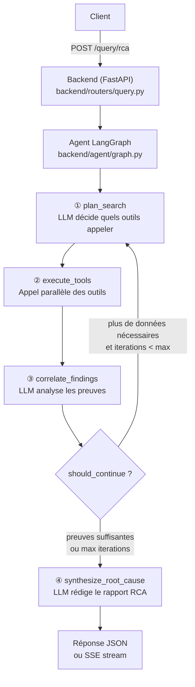
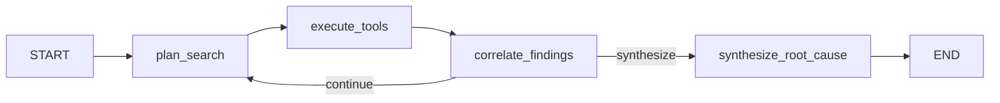
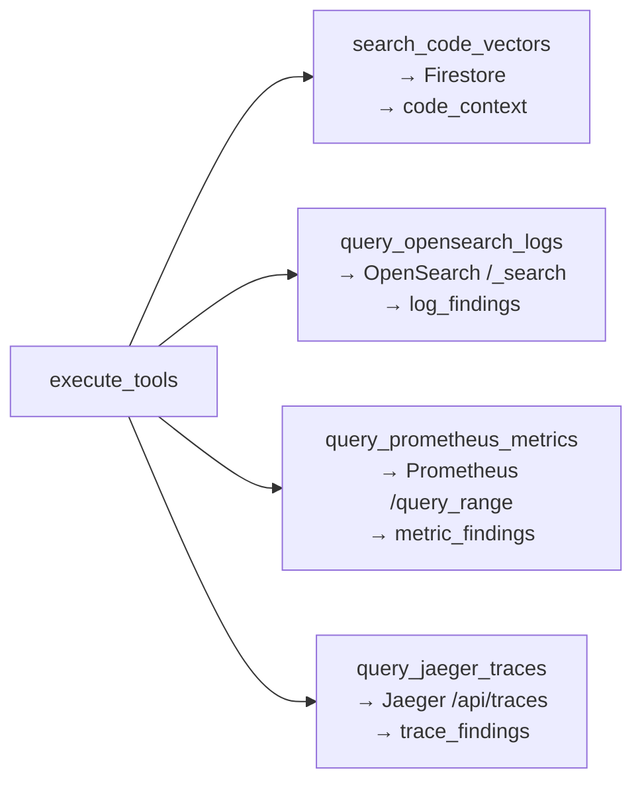

# Étape 5 — Agent RCA LangGraph (`/query/rca`)

Version francaise. English version: [05-rca-agent.en.md](./05-rca-agent.en.md)

> Flux complet : [Étape 1](./01-request-entry.md) → [Étape 2](./02-nats-publish.md) → [Étape 3](./03-worker-pipeline.md) → [Étape 4](./04-query-vector.md) → **[Étape 5]** → [Phase 6 — MCP](./06-mcp-future.md)

---

## Vue d'ensemble

`POST /query/rca` est le chemin le plus complexe. Au lieu de faire une recherche unique, il lance un **agent LangGraph** qui raisonne en plusieurs itérations : il décide quels outils appeler, collecte des preuves, forme des hypothèses, et synthétise un rapport RCA.



La boucle peut tourner **jusqu'à 8 fois** (`max_iterations`). À chaque tour, l'agent a accès aux preuves déjà collectées et décide si il en sait assez pour conclure.

---

## 5.1 Le handler HTTP — sync ou SSE

> `backend/routers/query.py` — fonctions `query_rca`, `_stream_rca`

```python
@router.post("/query/rca")
async def query_rca(req: RCAQueryRequest):
    initial_state = {
        "question": req.question,
        "service": req.service,
        "time_range": req.time_range,       # ex: "1h"
        "code_context": [],
        "log_findings": [],
        "metric_findings": [],
        "trace_findings": [],
        "hypotheses": [],
        "iteration": 0,
        "max_iterations": 8,
        ...
    }

    if req.stream:
        return StreamingResponse(_stream_rca(initial_state), media_type="text/event-stream")

    result = await rca_agent.ainvoke(initial_state)
    return {"root_cause": ..., "confidence": ..., "evidence": ..., "iterations": ...}
```

Deux modes de réponse :

| `stream: false` (défaut) | `stream: true` |
|---|---|
| Attend la fin de l'agent | Envoie un événement SSE par node traversé |
| Retourne un JSON final | Retourne `text/event-stream` |
| Utile pour tests / curl | Utile pour une UI qui affiche la progression |

**SSE (Server-Sent Events)** — le serveur garde la connexion HTTP ouverte et pousse des événements au fur et à mesure. Chaque node LangGraph qui termine envoie un `data: {...}\n\n`. Le client lit le stream ligne par ligne.

```python
async def _stream_rca(initial_state):
    async for event in rca_agent.astream(initial_state, stream_mode="updates"):
        for node_name, update in event.items():
            payload = {"node": node_name, "step": update.get("current_step"), ...}
            yield f"data: {json.dumps(payload)}\n\n"
    yield "data: [DONE]\n\n"
```

---

## 5.2 Le state LangGraph — ce qui circule entre les nodes

> `backend/agent/state.py` — classe `RCAState`

LangGraph fait circuler un **state** (un dict typé) entre chaque node. Chaque node reçoit le state courant et retourne un dict partiel qui le met à jour.

```python
class RCAState(TypedDict):
    # Entrée
    question: str
    service: str | None
    time_range: str

    # Preuves accumulées (Annotated[list, operator.add] = append, pas overwrite)
    code_context:    Annotated[list[dict], operator.add]
    log_findings:    Annotated[list[dict], operator.add]
    metric_findings: Annotated[list[dict], operator.add]
    trace_findings:  Annotated[list[dict], operator.add]

    # Raisonnement
    hypotheses:    Annotated[list[str], operator.add]
    current_step:  str
    iteration:     int
    max_iterations: int

    # Sortie
    root_cause:       str
    confidence:       float
    evidence_summary: dict
    messages:         Annotated[list[BaseMessage], add_messages]
```

**`Annotated[list, operator.add]`** — les listes de preuves s'**accumulent** à chaque itération au lieu d'être écrasées. Si l'agent trouve 3 logs au tour 1 et 5 au tour 2, `log_findings` contiendra 8 entrées au total.

---

## 5.3 Le graphe — définition des nodes et transitions

> `backend/agent/graph.py` — fonction `build_rca_graph`

```python
graph = StateGraph(RCAState)

graph.add_node("plan_search",        plan_search)
graph.add_node("execute_tools",      execute_tools)
graph.add_node("correlate_findings", correlate_findings)
graph.add_node("synthesize_root_cause", synthesize_root_cause)

graph.set_entry_point("plan_search")
graph.add_edge("plan_search",        "execute_tools")
graph.add_edge("execute_tools",      "correlate_findings")

graph.add_conditional_edges(
    "correlate_findings",
    should_continue,          # fonction de routage
    {
        "continue":   "plan_search",         # boucle
        "synthesize": "synthesize_root_cause", # sortie
    },
)
graph.add_edge("synthesize_root_cause", END)
```



---

## 5.4 Node ① — `plan_search` : le LLM décide

> `backend/agent/nodes.py` — fonction `plan_search`

Le LLM reçoit la question, le service ciblé, la fenêtre temporelle, et **toutes les preuves déjà collectées**. Il retourne un JSON décrivant quels outils appeler ensuite.

```python
resp = await llm.ainvoke([
    HumanMessage(content=PLAN_SYSTEM_PROMPT),
    HumanMessage(content=f"Question: {state['question']}\n...Evidence: {evidence}"),
])
# Réponse attendue du LLM :
# {"tools": [
#   {"name": "query_opensearch_logs", "args": {"service_name": "frontendproxy", "query_string": "error OR timeout", "lookback_minutes": 60}},
#   {"name": "search_code_vectors", "args": {"query": "...", "service_filter": "checkoutservice"}}
# ], "ready": false}
```

Si le LLM répond `"ready": true` → l'agent passe directement à `synthesize_root_cause` sans appeler d'outils.

Si le JSON est malformé → fallback sur `search_code_vectors` avec la question brute.

---

## 5.5 Node ② — `execute_tools` : appel des outils

> `backend/agent/nodes.py` — fonction `execute_tools`

Exécute chaque outil du plan dans l'ordre. Les résultats vont dans les bonnes clés du state.

```python
tool_map = {
    "search_code_vectors":    search_code_vectors,    # → code_context
    "query_opensearch_logs":  query_opensearch_logs,   # → log_findings
    "query_prometheus_metrics": query_prometheus_metrics, # → metric_findings
    "query_jaeger_traces":    query_jaeger_traces,     # → trace_findings
}

for call in tool_calls:
    result = await tool_map[call["name"]].ainvoke(call["args"])
    updates[result_key_map[call["name"]]] = result
```

Les 4 tools et ce qu'ils interrogent :

| Tool | Fichier | Source de données | Langage de requête |
|------|---------|-------------------|--------------------|
| `search_code_vectors` | `backend/agent/tools/code_search.py` | GCP Firestore | vecteurs — langage naturel |
| `query_opensearch_logs` | `backend/agent/tools/opensearch.py` | OpenSearch (logs) | query API |
| `query_prometheus_metrics` | `backend/agent/tools/prometheus.py` | Prometheus (métriques) | PromQL |
| `query_jaeger_traces` | `backend/agent/tools/jaeger.py` | Jaeger (traces) | Jaeger HTTP API |



Chaque tool fait un appel HTTP direct à son backend. Dans l'architecture ciblée, les signaux live viennent de `OpenSearch`, `Prometheus` et `Jaeger` dans le namespace `otel-demo`. Si un tool échoue, l'agent continue avec les autres — l'erreur est loggée et ajoutée aux messages du state.

**Où vivent physiquement ces données ?**

- L'agent **ne lit pas** un bucket, un PVC ou une base brute directement ; il interroge les APIs HTTP de OpenSearch, Prometheus et Jaeger.
- Vérification cluster du `2026-04-13` : `otel-demo-prometheus-server` stocke sa TSDB dans `/data`, monté sur un volume `EmptyDir`.
- Il n'y avait **aucun PVC** ni **aucun StatefulSet** visible dans le namespace `otel-demo`, donc les métriques Prometheus actuellement visibles sont sur du stockage éphémère de pod.
- Le backend et les manifests GitOps ont été réalignés sur `otel-demo-opensearch`, `otel-demo-prometheus-server` et `otel-demo-jaeger-query`, qui correspondent à la stack OpenTelemetry Demo configurée.

---

## 5.6 Node ③ — `correlate_findings` : le LLM analyse

> `backend/agent/nodes.py` — fonction `correlate_findings`

Le LLM reçoit **toutes les preuves accumulées** (code + logs + métriques + traces) et produit des hypothèses.

```python
resp = await llm.ainvoke([
    HumanMessage(content=CORRELATE_SYSTEM_PROMPT),
    HumanMessage(content=f"Question: {state['question']}\n\n{evidence}"),
])
# Réponse attendue :
# {
#   "hypotheses": ["Le checkoutservice échoue sur l'appel gRPC au paymentservice..."],
#   "needs_more_data": true,
#   "next_focus": "vérifier les métriques de latence du paymentservice"
# }
```

`needs_more_data: true` → `should_continue` retourne `"continue"` → nouvelle itération.  
`needs_more_data: false` → `should_continue` retourne `"synthesize"` → fin de boucle.

---

## 5.7 Condition de sortie — `should_continue`

> `backend/agent/nodes.py` — fonction `should_continue`

```python
def should_continue(state: RCAState) -> str:
    if state["iteration"] >= state["max_iterations"]:
        return "synthesize"   # sécurité — évite une boucle infinie

    if state.get("_plan", {}).get("ready") or not state.get("_needs_more_data"):
        return "synthesize"

    return "continue"
```

Trois cas qui déclenchent la synthèse :
1. **`iteration >= 8`** — garde-fou contre les boucles infinies
2. **`ready: true`** dans le plan — le LLM lui-même déclare avoir assez de données
3. **`needs_more_data: false`** après corrélation — le LLM a trouvé la cause

---

## 5.8 Node ④ — `synthesize_root_cause` : le rapport final

> `backend/agent/nodes.py` — fonction `synthesize_root_cause`

Dernier appel LLM. Il reçoit toutes les preuves et hypothèses, et produit le rapport RCA structuré.

```python
resp = await llm.ainvoke([
    HumanMessage(content=SYNTHESIZE_SYSTEM_PROMPT),
    HumanMessage(content=f"Question: ...\n\n{evidence_summary}"),
])
# Réponse attendue :
# {
#   "root_cause": "Le checkoutservice échoue à cause d'un timeout gRPC vers le paymentservice...",
#   "confidence": 0.87,
#   "evidence_summary": {
#     "code":    ["PlaceOrder() appelle paymentservice.Charge() sans retry"],
#     "logs":    ["checkoutservice: rpc error: code = DeadlineExceeded"],
#     "metrics": ["p99 latency paymentservice > 5s depuis 14h32"],
#     "traces":  ["trace abc123: span paymentservice.Charge duration=5200ms, status=error"]
#   }
# }
```

---

## 5.9 Le LLM utilisé — Azure OpenAI, Vertex AI, fallback et switch

> `backend/llm/providers.py` — fonction `get_chat_llm`

Chaque node qui appelle le LLM passe par `get_chat_llm()`. Cette fonction configure automatiquement le fallback :

```python
primary = AzureChatOpenAI(deployment="gpt-4o", ...)
fallback = ChatVertexAI(model_name="gemini-1.5-pro", ...)

return primary.with_fallbacks([fallback])
# Si Azure OpenAI → 429 ou erreur → LangChain bascule automatiquement sur Gemini

# Ou bien, avec le mode switch :
# LLM_PROVIDER_STRATEGY=switch
# LLM_SWITCH_PROVIDER=vertex
# -> le backend force Vertex AI sans attendre d'erreur
```

Si **Langfuse** est configuré (`LANGFUSE_PUBLIC_KEY`), chaque appel LLM est tracé automatiquement via le callback LangChain — utile pour débugger les prompts et mesurer les coûts (Phase 5).

---

## Résumé de l'étape 5

| Node | Fichier | Rôle | LLM ? |
|------|---------|------|-------|
| `plan_search` | `backend/agent/nodes.py` | Décide quels outils appeler | ✅ |
| `execute_tools` | `backend/agent/nodes.py` | Appelle les 4 tools (code/logs/métriques/traces) | ❌ |
| `correlate_findings` | `backend/agent/nodes.py` | Analyse les preuves, forme des hypothèses | ✅ |
| `synthesize_root_cause` | `backend/agent/nodes.py` | Rédige le rapport RCA final | ✅ |
| `should_continue` | `backend/agent/nodes.py` | Décide de boucler ou de synthétiser | ❌ |
| Graphe | `backend/agent/graph.py` | Définit les transitions entre nodes | — |
| State | `backend/agent/state.py` | Données circulant entre nodes | — |
| LLM | `backend/llm/providers.py` | gpt-4o (primary) + gemini-1.5-pro (fallback) | — |
| Tools | `backend/agent/tools/` | Firestore, OpenSearch, Prometheus, Jaeger | — |

---

## Etat de validation live

Validation MVP obtenue le 2026-04-14 :

- `search_code_vectors` valide sur `frontendproxy`
- `query_opensearch_logs` valide sur `productcatalogservice`
- `query_jaeger_traces` valide sur `frontendproxy`
- `/query/rca` est stable et ne fait plus redemarrer `rag-backend`

Limites connues :

- `query_prometheus_metrics` reste un follow-up separe
- le cluster `otel-demo` slim ne fournit pas encore un service unique qui expose proprement `code + logs + metrics + traces` pour un test RCA complet sur une seule cible
