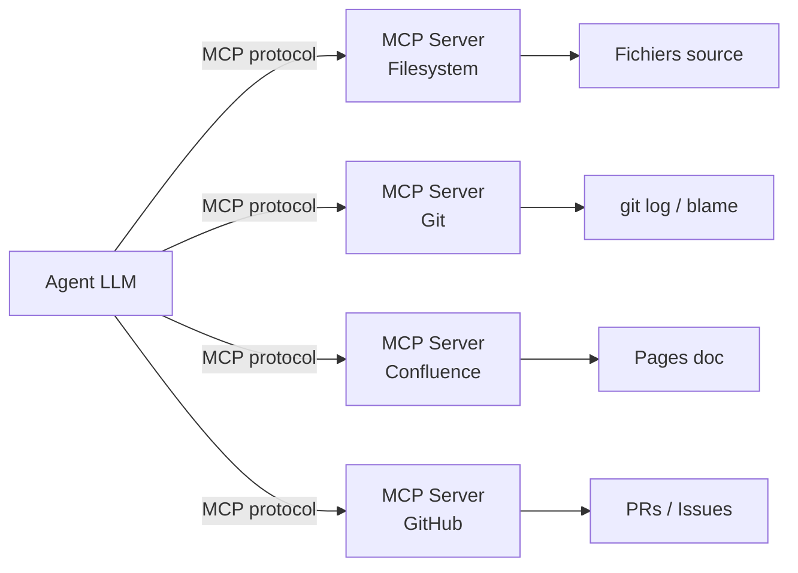
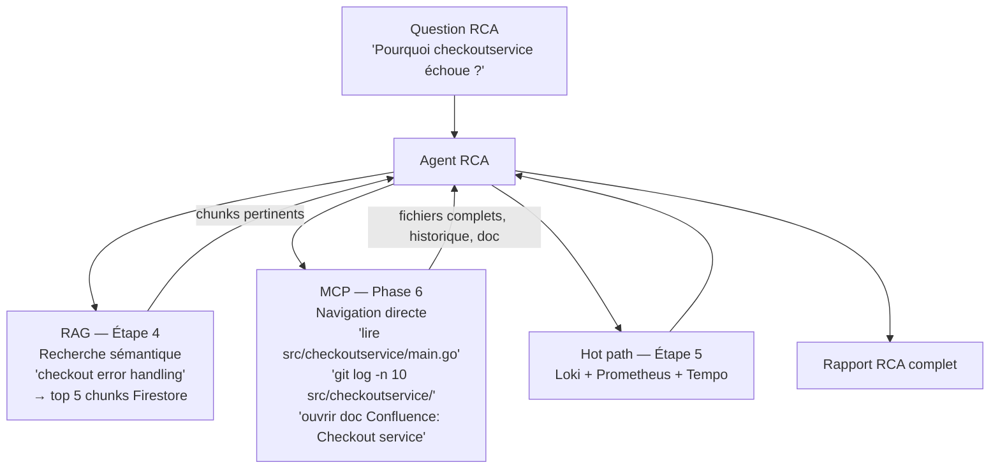

# Phase 6 — MCP (Model Context Protocol) — Future implementation

> **Statut : non implémenté.** MCP sera introduit après stabilisation de la plateforme (post Phase 5 — Langfuse + Kubecost) et post intégration Chainlit.
>
> Ce document décrit l'architecture cible et les motivations du choix.

---

## C'est quoi MCP ?

**Model Context Protocol** est un protocole open source développé par Anthropic. Il définit une interface standardisée entre un LLM et des **sources de données externes** — fichiers, APIs, outils, bases de données.

Concrètement : MCP permet à un agent LLM d'appeler des "serveurs MCP" qui exposent des **ressources** (lecture de fichiers, requêtes git, pages Confluence) et des **tools** (écriture, recherche, exécution). L'agent navigue dans les données à la demande, au lieu de travailler uniquement sur ce qu'on lui a pré-indexé.



---

## Pourquoi RAG ne suffit pas seul

Le RAG (Retrieval-Augmented Generation) pré-indexe le code et retourne les chunks les plus proches d'une question. C'est efficace pour la **découverte sémantique** — trouver quel fichier parle de "gestion d'erreur checkout" parmi 10 000 fichiers.

Mais il a des limites structurelles :

| Limitation RAG | Situation concrète |
|---|---|
| Index figé dans le temps | Le code change, l'index peut être stale |
| Chunk sans contexte parent | Un chunk de 40 lignes peut manquer les 10 lignes d'avant qui expliquent tout |
| Pas de navigation arborescente | Impossible de demander "liste les fichiers de `src/checkoutservice/`" |
| Pas de git blame | Impossible de savoir qui a modifié cette ligne et pourquoi |
| Pas de lecture de doc structurée | Une page Confluence avec 15 tableaux perd sa structure dans un chunk texte |

MCP résout exactement ces cas : l'agent peut **lire un fichier entier**, **naviguer dans l'arborescence**, **consulter git log**, **ouvrir une page Confluence** — à la demande, sans pré-indexation.

---

## Architecture cible — RAG + MCP hybride

L'idée de Phase 6 n'est pas de remplacer RAG par MCP, mais de les combiner : **RAG pour trouver, MCP pour lire**.



**Le flux hybride :**
1. L'agent utilise **RAG** pour identifier les zones de code pertinentes rapidement (~100ms, cross-repo)
2. Il utilise **MCP** pour lire les fichiers complets des zones identifiées, naviguer dans l'arborescence adjacente, consulter git blame sur les lignes suspectes
3. Il utilise les **tools observabilité** (Loki, Prometheus, Tempo) pour les signaux live

---

## Quels serveurs MCP seraient déployés

| Serveur MCP | Exposé par | Ce qu'il permet |
|---|---|---|
| `filesystem` | MCP server officiel Anthropic | Lecture de fichiers, listing de répertoires |
| `git` | MCP server officiel Anthropic | `git log`, `git blame`, `git diff`, `git show` |
| `github` | MCP server officiel Anthropic | PRs, Issues, code review comments |
| `confluence` | MCP server custom ou community | Lecture de pages, espaces, recherche |
| `fetch` | MCP server officiel Anthropic | Lecture de pages web (docs, runbooks) |

Dans le contexte Kubernetes, chaque serveur MCP tournerait comme un sidecar ou un service dédié dans le namespace `rag-dev`, accessible par le backend via le protocole MCP (stdio ou HTTP/SSE).

---

## Impact sur l'agent RCA existant

L'agent actuel (étape 5) a 4 tools :

```
search_code_vectors   ← RAG (Firestore)
query_loki_logs       ← HTTP Loki
query_prometheus_metrics ← HTTP Prometheus
query_tempo_traces    ← HTTP Tempo
```

En Phase 6, le `plan_search` node pourrait décider d'appeler des tools MCP supplémentaires :

```
search_code_vectors        ← RAG — inchangé
read_file                  ← MCP filesystem — nouveau
git_blame                  ← MCP git — nouveau
get_confluence_page        ← MCP confluence — nouveau
query_loki_logs            ← HTTP Loki — inchangé
query_prometheus_metrics   ← HTTP Prometheus — inchangé
query_tempo_traces         ← HTTP Tempo — inchangé
```

Le graphe LangGraph n'a pas besoin de changer — juste étendre la `tool_map` dans `execute_tools` avec les nouveaux tools MCP.

---

## Pourquoi MCP est repoussé à Phase 6

Trois raisons :

**1. Stabiliser d'abord le pipeline existant** — le smoke test e2e (Phase 4.5d) n'est pas encore validé. Ajouter MCP avant que RAG + RCA soient stables introduirait des variables de debug supplémentaires.

**2. MCP a besoin d'une UI** — les interactions MCP (navigation fichiers, git blame) sont plus naturelles dans une interface conversationnelle comme **Chainlit** (Phase 5+). Sans UI, MCP n'apporte pas grand chose sur une API JSON.

**3. Sécurité** — un serveur MCP filesystem exposé dans le cluster avec accès aux repos nécessite une réflexion sur les permissions (quel agent peut lire quoi). À faire proprement après les bases posées.

---

## Ce qui resterait dans RAG en Phase 6

MCP ne remplace pas RAG — il le complète. RAG reste indispensable pour :

- **Recherche cross-repo à grande échelle** — avec N repos et des milliers de fichiers, un agent MCP ne peut pas tout lire. RAG pré-indexe et retourne les 5 fichiers pertinents en ~100ms.
- **Requêtes sémantiques** — "trouver du code qui gère les timeouts de paiement" n'a pas de réponse directe en MCP. RAG trouve par intention, MCP lit par chemin.
- **Confluence / docs** — l'index vectoriel reste utile pour rechercher dans 1000+ pages. MCP lit la page une fois identifiée par RAG.

**Analogie :** RAG est le moteur de recherche, MCP est le navigateur. On cherche d'abord, on lit ensuite.
