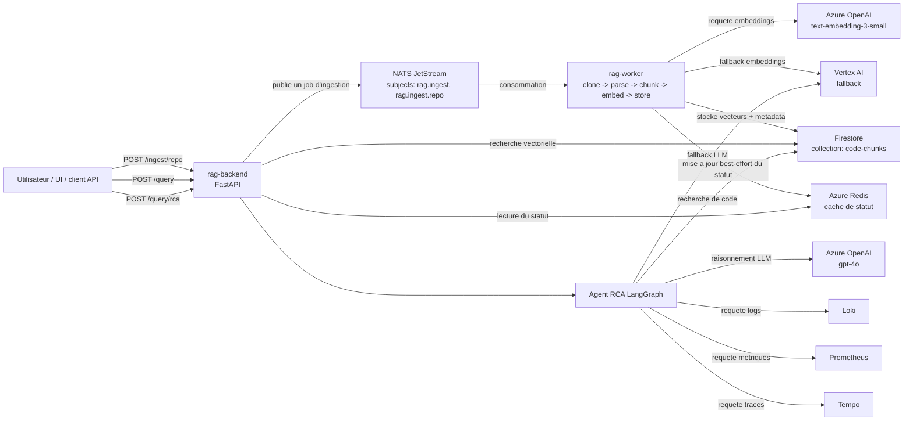

# Architecture

Version francaise. English version: [ARCHITECTURE.md](./ARCHITECTURE.md)

Cette page documente l'architecture d'execution de `rag-platform-app` avec des diagrammes Mermaid.

Une source draw.io editable est aussi disponible dans [architecture-diagram.drawio](./architecture-diagram.drawio).

## Vue end-to-end

## Sources observabilite

L'agent RCA ne lit pas les logs, metriques ou traces depuis des buckets, des PVC ou des bases de donnees brutes.

Il interroge directement les API HTTP de :
- Loki pour les logs
- Prometheus pour les metriques
- Tempo pour les traces

Ces appels sont implementes dans :
- [backend/agent/tools/loki.py](../backend/agent/tools/loki.py)
- [backend/agent/tools/prometheus.py](../backend/agent/tools/prometheus.py)
- [backend/agent/tools/tempo.py](../backend/agent/tools/tempo.py)

## Stockage physique dans le cluster actuel

Observe dans AKS le 2026-04-13 :
- `otel-demo-prometheus-server` stocke sa TSDB dans `/data`
- `/data` est monte depuis un volume `EmptyDir`
- aucun PVC n'etait present dans `otel-demo`
- aucun StatefulSet n'etait present dans `otel-demo`

Cela signifie que les metriques Prometheus actuellement visibles sont stockees sur un stockage ephemere du pod, et non sur un disque persistant revendique via PVC.

Pour Loki et Tempo, le backend est configure pour interroger :
- `otel-demo-loki`
- `otel-demo-tempo`

En revanche, ces services n'etaient pas presents dans le namespace au moment de la verification. Leur backend de stockage physique n'a donc pas pu etre confirme depuis les ressources actives.
