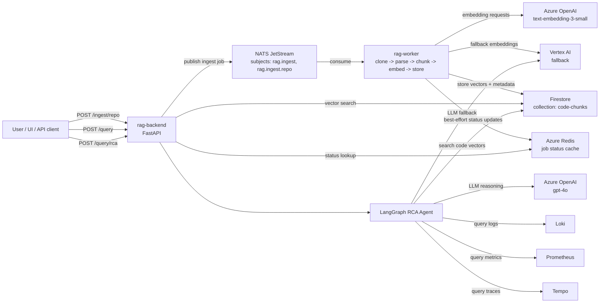
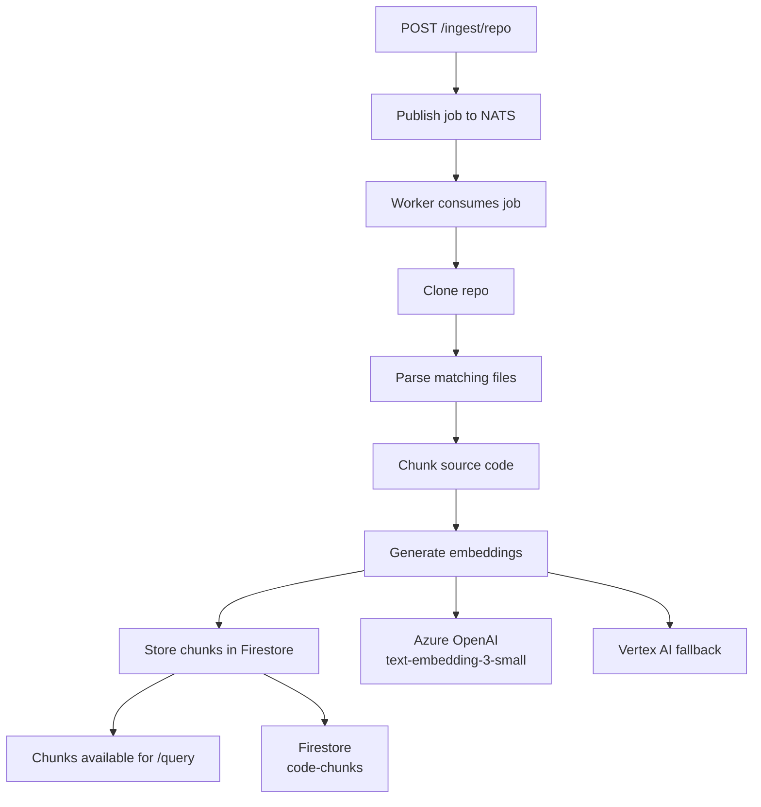
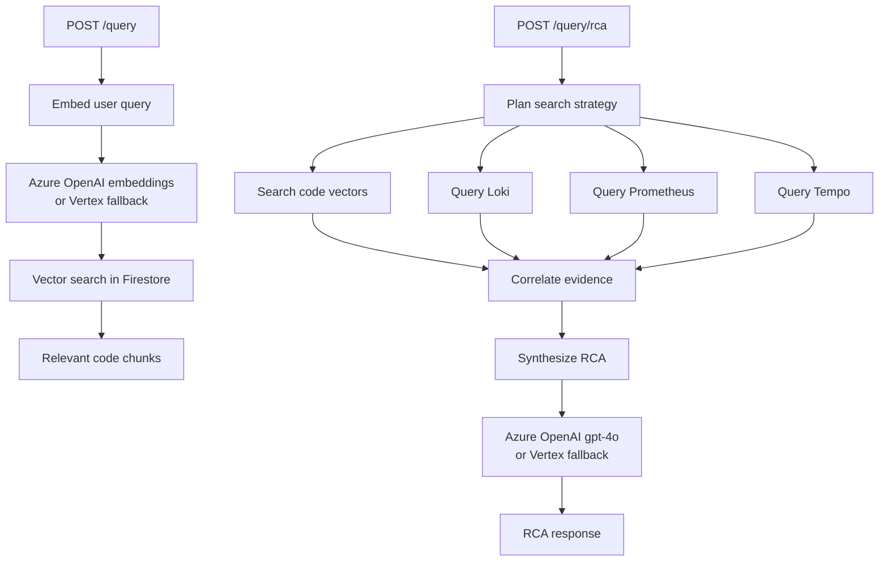

# Architecture

This page documents the runtime architecture of `rag-platform-app` with Mermaid diagrams.

GitHub renders Mermaid directly in Markdown, which makes it a good fit for versioned architecture docs.

An editable draw.io source is also available in [architecture-diagram.drawio](/C:/Users/cheik/OneDrive/Old%20OneDrive/Documents/code/mon-rag-multicloud/rag-platform-app/docs/architecture-diagram.drawio).

## End-to-End View

## Ingestion Flow

## Query and RCA Flow

## What Lives Where

- Azure OpenAI computes embeddings and chat completions.
- Firestore stores embedded code chunks and serves vector search.
- The backend orchestrates query and RCA requests.
- The worker handles asynchronous ingestion.
- Loki, Prometheus, and Tempo provide runtime observability evidence to the RCA agent.
- Redis is optional and only used for ingest job status tracking.

## Protocol Notes

- `backend -> NATS JetStream`: NATS client protocol over TCP via the NATS server.
- `worker -> Azure OpenAI` for embeddings: HTTPS requests to the Azure OpenAI REST API.
- `backend/agent -> Azure OpenAI` for chat: HTTPS requests to the Azure OpenAI REST API.
- `worker -> Firestore` for vector storage: Google Cloud Firestore client calls, implemented over Google APIs/gRPC by the SDK.
- `backend -> Firestore` for vector search: same Firestore client path, via the Google SDK.
- `agent -> Loki / Prometheus / Tempo`: HTTP API calls (`LogQL`, `PromQL`, `TraceQL` queries, depending on the backend).
- `backend/worker -> Redis`: Redis protocol via the async Redis client, when Redis is available.
